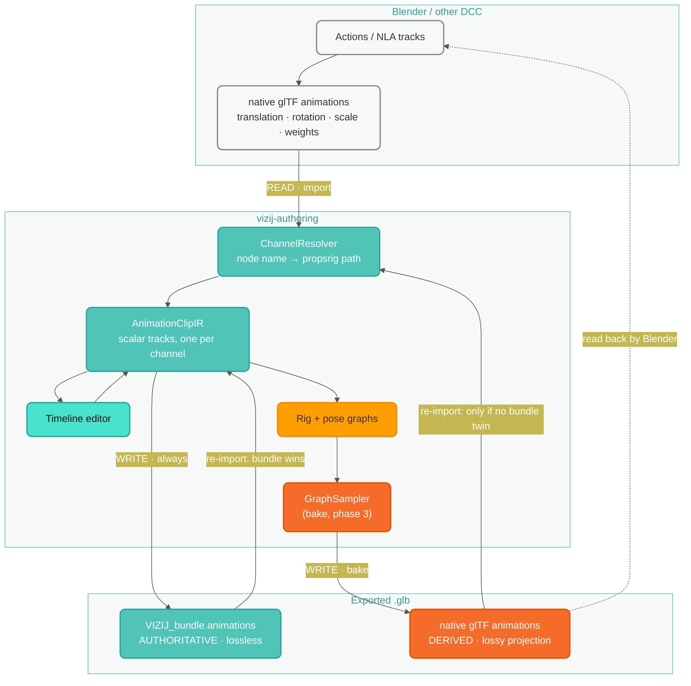

# Animation Interop: Reading and Writing Animation Across Tools

Last updated: 2026-09-02
Audience: engineers and riggers moving animation between Vizij and other tools
(Blender first and foremost)

This is the reference for how animation enters and leaves Vizij. For the
delivery plan and open work see
[`plans/GLB_ANIMATION_ROUNDTRIP_PLAN_2026-09-02.md`](plans/GLB_ANIMATION_ROUNDTRIP_PLAN_2026-09-02.md).

## The one thing to know

**Animation bindings are name-derived, not id-derived.**

A Vizij animation track binds to a channel path built from three things:

```text
channel    = /propsrig/{element name}/{feature key}/{component}
variableId = channel with "/" replaced by "_"
```

Nothing in a track references an animatable's id. Animatable ids are random
(`createBrowserSafeId`) and are regenerated every time a GLB without Vizij's
`RobotData` extension is imported — which is every GLB that has been through
Blender. **That regeneration does not break animation.**

What breaks a binding is a change to the triple
**(element name, feature key, component)**:

| Change in Blender                           | Effect                                         |
| ------------------------------------------- | ---------------------------------------------- |
| Rename an object                            | binding breaks — track detaches, needs a remap |
| Rename a shape key                          | binding breaks — track detaches, needs a remap |
| Delete a mesh                               | binding breaks — track detaches                |
| Move, re-parent, re-material, re-topologise | binding survives                               |
| Add objects                                 | no effect on existing tracks                   |

So the rule for anyone editing outside Vizij is short: **keep names stable.**

## The read/write cycle



Read the diagram as two asymmetric halves:

- **Teal** is the authoritative path. The bundle is where animation truly lives.
- **Orange** is the interop projection. Baked glTF animation is written _for
  other tools_, is lossy, and is never trusted over the bundle on re-import.

## READ: importing animation from a GLB

Entry point: **File ▸ Import Animations from GLB…**, implemented in
`src/animationImport/importGltfAnimations.ts`. A face must be loaded first —
channels are matched against that face's inputs.

The path is split into a byte-decoding half and a pure conversion half, which
are the two useful units:

```text
ArrayBuffer --readGltfAnimationDocument--> GltfAnimationDocument
                                                    |
                        catalog ------------------> convertGltfAnimations
                                                    |
                                                    v
                                           AnimationClipIR[]
```

`importGltfAnimations(glb, catalog)` is a thin composition of the two, kept for
callers that just have a file. Reach past it when you already hold a document,
or want to exercise the conversion without constructing a GLB:
`convertGltfAnimations` is a pure function of plain data, so its tests build
documents as literals.

### Step 1 — decode

`gltfAccessors.ts` splits the GLB into its JSON and BIN chunks and decodes
sampler accessors directly, and `readGltfAnimationDocument` assembles the
result into a `GltfAnimationDocument`: per-animation curves carrying node name,
channel path, interpolation, times, flattened values, stride, and morph feature
keys. Decoding deliberately does not go through Three.js, so the import path is
deterministic and testable in plain Node, and is unaffected by `GLTFLoader`'s
node-name sanitizing or its per-mesh track splitting.

Decode failures (sparse accessors, external buffers, empty samplers) are
collected on the document as `readErrors` rather than thrown, so one bad
sampler does not lose the rest of the file; conversion re-reports them as
`error` diagnostics.

Not supported, and reported rather than guessed: sparse accessors, and buffers
stored outside the GLB.

### Step 2 — enumerate channels

`gltfAnimationChannels.ts` lists every channel targeting a property Vizij can
drive, then expands each into scalar curves, because Vizij tracks are
scalar-per-track:

| glTF channel  | Expands to                          |
| ------------- | ----------------------------------- |
| `translation` | 3 scalars (x, y, z)                 |
| `scale`       | 3 scalars (x, y, z)                 |
| `rotation`    | 3 scalars, after quaternion → euler |
| `weights`     | 1 scalar per morph target           |

Morph target names come from `meshes[].extras.targetNames` and are turned into
feature keys with the **same** `sanitizeMorphKey` that geometry import uses
(`@vizij/render`). Sharing that one function is what makes morph channels line
up; two copies of the rule would silently drift.

### Step 3 — resolve to Vizij channels

`resolveGltfAnimationChannels.ts` maps each scalar onto a propsrig input path.
Two modes:

- **Identity mode** — when the GLB still carries `RobotData`: glTF node index →
  `RobotData` feature → componentId → input. An exact lookup.
- **Name mode** — the Blender case, where the extension was dropped: node name
  and channel path are normalized into a propsrig path with
  `buildPropsRigInputPath`, the same helper the rig generator uses.

Matching is **exact, not fuzzy**. On the three Blender exports in
`public/assets` it resolves 100% of channels (37/31/8, zero unresolved), so
fuzzy fallbacks would add risk without adding coverage. Anything unresolved is
reported with the path that was attempted — never dropped silently.

### Step 4 — convert values

Rotation is the only channel needing real conversion. glTF stores quaternions;
Vizij's rotation animatable is an **euler in `ZYX` order** (every renderable
calls `rotation.set(x, y, z, "ZYX")`). `quaternionToEuler.ts` handles it, and
two corrections matter:

1. **Sign continuity** — `q` and `-q` are the same rotation and exporters emit
   either. Converting a sign-flipped pair independently puts the euler values on
   opposite branches, so each quaternion is negated when its dot product with
   the previous one is negative.
2. **Angle unwrapping** — `atan2` returns `(-π, π]`, so a rotation crossing π
   reads as a 360° snap. Each channel is shifted into the branch nearest its
   predecessor.

Two lossy cases are reported, not hidden:

- `CUBICSPLINE` rotation: quaternion tangents have no euler equivalent, so the
  value column is used and the curve becomes linear through the same keys.
- Keys at the euler singularity (pitch near ±90°), where one axis becomes
  indeterminate.

Translation, scale and morph channels need no conversion at all: the animation
lives in the same file as the geometry, so its values are already in the frame
the animatable defaults were read from. No unit or axis conversion.

### Step 5 — group into clips

The rule is **1 glTF animation = 1 Vizij clip**, which is correct for every
export mode except Blender's default.

| Blender Animation Mode | glTF result                                             | Vizij result                      |
| ---------------------- | ------------------------------------------------------- | --------------------------------- |
| **Actions** (default)  | one animation per action per object; grouping discarded | reassembled into one clip         |
| Active actions merged  | one animation, all objects                              | 1 clip                            |
| **NLA Tracks**         | one animation per track                                 | 1 clip per track — the clean case |
| Scene                  | one animation for the timeline                          | 1 clip                            |

In per-Action mode Blender has already thrown the grouping away before Vizij
sees the file. What survives is timing: the fragments occupy disjoint
sub-ranges of one shared timeline. So they are reassembled at the times they
already carry.

**Fragments are never individually shifted to start at zero.** Doing that would
collapse all 13 of Quori's fragments onto t=0 and destroy the choreography.

Detection is by file shape — many animations, 1–2 channels each, names matching
Blender's auto-action pattern `<datablock>Action<.NNN>` — and the UI names the
fix: re-export with **Animation Mode = NLA Tracks** to keep your own grouping.

## WRITE: exporting animation

Two outputs, with different standing.

### The bundle (authoritative, always written)

Authored clips are compiled to `VizijBundleExtension.animations` inside the GLB.
Lossless, covers every channel type, and round-trips exactly. This is where
animation lives.

Detached tracks (see below) are held in authored state but **excluded** from the
bundle, so a stale channel never reaches the runtime.

### Baked glTF animation (derived, lossy, for other tools)

Baking is **not** a reformat of the authored tracks. Real authored clips drive
_abstract rig inputs and pose weights_, not node transforms:

```text
clip "authoring.timeline.clip.1"  channel="lids_blink"
clip "authoring.timeline.clip.1"  channel="gaze/left_right"
clip "authoring.timeline.main"    channel="poses/pose_d_concerned_d.weight"
```

glTF cannot express "this input feeds a graph that computes node transforms", so
baking has to **evaluate the rig and pose graphs over time** — stage inputs per
frame, `setTime`, `evalAll`, record every animatable, then decimate and
recombine. One track on `lids_blink` can bake to dozens of node channels.

What can and cannot bake:

| Vizij channel                                          | Bakes to glTF?                                       |
| ------------------------------------------------------ | ---------------------------------------------------- |
| propsrig `translation` / `scale` x/y/z                 | yes — recombined to stride-3 vectors                 |
| propsrig `rotation` x/y/z                              | yes — euler converted back to quaternion             |
| propsrig morph / blendshape                            | yes — emitted by morph **name**                      |
| material features (`color`, `opacity`, …)              | **no** — glTF core has no material animation channel |
| abstract rig inputs, pose weights, group/stage outputs | **no** — graph-level, not node properties            |

Material channels are ~25–30% of the drivable channels on the current faces
(always `color` and `opacity`), so the gap is real and deliberate: the bundle
keeps those curves losslessly, and the export preflight **names** the dropped
channels so an author who animated a colour learns it before exporting rather
than after opening the file elsewhere.

`GLTFExporter` also imposes hard constraints worth knowing before touching the
baker: it supports only `position` / `quaternion` / `scale` /
`morphTargetInfluences`; it has no per-component channels; morph tracks must be
named by morph name or it throws; cubic morph tracks throw; and a single
unresolvable track binding makes it discard the **entire clip** after only a
console warning. Every track must therefore be pre-validated, and bound by
name — the export root is cloned, so uuid bindings break.

## Fitting imported curves to input ranges

A propsrig input's range is inferred from a **single rest value**
(`computeScaleBounds` / `computeTranslationBounds` in `@vizij/utils`, and a
hard `±π` bound on euler). One static sample cannot bound a curve, and the rig
graph clamps every channel to its input range — so an imported animation that
leaves the range is silently flattened.

Measured on `Quori_Latest_Blender_Export.glb`:

```text
L_EyeHighlight.scale.x  range=[-0.022, 2.000]  curve=[-0.038, -0.022]  entirely below min
R_EyeHighlight.scale.x  range=[-0.087, 2.000]  curve=[-0.150, -0.087]  entirely below min
R_Eye.scale.x           range=[ 0.000, 6.567]  curve=[ 5.471,  6.584]  clipped at the top
```

The eye highlights have **negative** rest scale (mirrored geometry), so their
range becomes `[rest, 2]` and any animation going more negative than rest falls
off the bottom. Unwrapped rotation hits the same wall from the other side: it
deliberately produces continuous values that can exceed `±π`.

So import **widens the target input's range** to admit the curve, with 1%
headroom so a boundary value is not left at the mercy of the clamp, and names
every widening in the import summary:

```text
Widened 6 input range(s) so the imported curves are not clamped:
• propsrig/l_eyehighlight/scale/x: [-0.022, 2] -> [-0.0382, 2] (curve spans -0.038..-0.022)
```

Widening is chosen over the alternatives because it is the only lossless one:
clamping destroys motion and normalizing changes it. Real animation data is
better evidence of a channel's true extent than a rest sample. A widening never
narrows an existing bound, and re-running the fit after applying it finds
nothing left to change (asserted by test).

Note this mutates authored input ranges, which are part of the exported rig.

## De-duplicating re-imports

Re-importing the same GLB is routine — after a geometry edit, or just to check
something — and must not accumulate identical clips.

Incoming clips are matched on **content**, not on file name or clip id:
`animationClipContentSignature` canonicalizes a clip to its channels,
interpolation, times, values and tangents, deliberately ignoring clip/track ids,
labels, colours, track order, and detached tracks. Anything content-equal to a
clip already in the session is skipped and reported in the import summary
("Skipped 1 clip(s) already present: …").

That means a Blender re-export which changed geometry but not animation still
de-duplicates, while a genuinely edited curve imports as a new clip.

Provenance (`bakedFrom` / `bakeHash` in glTF `extras`) is a stronger signal and
handles the bake round trip specifically — see the triage table below. Content
matching is what covers the native-glTF import case, where there is no Vizij
provenance to read.

## Surviving external edits

### Precedence

The bundle wins. A baked clip must never overwrite the bundle clip it came from.

Every baked animation carries provenance in its **`extras`** — not in a custom
extension — because Blender maps extras to custom properties and writes them
back, while unknown extensions are dropped. Without this, every Blender pass
would look like brand-new external animation and duplicate clips on each round
trip.

```text
extras.vizij = { bakedFrom, bakeHash, bakedAt, channelManifestHash, lossy[] }
```

On import:

| Case | Condition                                      | Behavior                                                            |
| ---- | ---------------------------------------------- | ------------------------------------------------------------------- |
| 1    | baked clip matches a bundle clip, hashes agree | ignore the baked copy, silently                                     |
| 2    | matches a bundle clip, hashes differ           | externally edited — offer keep / adopt / fork. **Never auto-merge** |
| 3    | no bundle counterpart                          | genuinely external — import via name resolution                     |

The hash covers only animation-relevant content: durations, channels,
interpolation, keyframes. Labels, colours and track ids are excluded so a
re-render never reads as an external edit.

### Drift and detached tracks

A channel manifest is persisted at export recording, per channel, the
`(elementName, featureKey, component, morphName)` it came from — the path alone
cannot be reversed, because normalization is lossy. Diffing it on import
classifies each channel as unchanged, renamed, deleted, added, or shifted by a
name-collision suffix.

When a channel disappears, its track is **detached, not deleted**:
`AnimationTrackIR.detached` is set, `channel` keeps the stale path so it can be
re-attached, and the track is excluded from compile and from the bundle.

This is the point: a rename in Blender should cost a remap click, not hours of
keyframing.

## Recommendations for riggers

1. **Keep object and shape-key names stable.** Names are the binding contract.
2. **Export with Animation Mode = NLA Tracks** if you want your grouping to
   survive; the default per-Action mode discards it and Vizij reassembles.
3. Expect **colour and opacity animation not to appear** in a baked GLB. It is
   safe in the bundle; it just cannot be expressed in glTF.
4. Prefer keeping pitch away from ±90° on rotating elements — the euler
   singularity there makes one axis indeterminate.
5. Re-import the Vizij-exported GLB rather than a hand-assembled one where
   possible, so provenance survives and clips do not duplicate.

## Where the code lives

| Concern                                                | File                                                  |
| ------------------------------------------------------ | ----------------------------------------------------- |
| GLB chunk + accessor decoding                          | `src/animationImport/gltfAccessors.ts`                |
| Decoded document (the conversion's input type)         | `src/animationImport/gltfAnimationDocument.ts`        |
| **Document -> clips, pure**                            | `src/animationImport/convertGltfAnimations.ts`        |
| Bake: clips -> glTF-shaped tracks                      | `src/animationBake/bakeClip.ts`                       |
| Bake: track specs -> `THREE.AnimationClip` (validated) | `src/animationBake/toThreeAnimationClip.ts`           |
| Channel enumeration and scalar expansion               | `src/animationImport/gltfAnimationChannels.ts`        |
| Name/identity resolution                               | `src/animationImport/resolveGltfAnimationChannels.ts` |
| Target catalog (live inputs or `RobotData`)            | `src/animationImport/propsRigTargetCatalog.ts`        |
| Quaternion → euler (`ZYX`)                             | `src/animationImport/quaternionToEuler.ts`            |
| Grouping, clip synthesis, diagnostics                  | `src/animationImport/importGltfAnimations.ts`         |
| Manifest + provenance contract                         | `src/animationImport/channelManifest.ts`              |
| Canonical propsrig path rule                           | `src/rig/autoInputs.ts` (`buildPropsRigInputPath`)    |
| Canonical morph key rule                               | `@vizij/render` (`sanitizeMorphKey`)                  |
| Clip normalization / bundle conversion                 | `src/utils/animationClipCompiler.ts`                  |
| GLB export (incl. the unused `animations` option)      | `@vizij/render` (`exportScene`)                       |

Corpus regression tests live in `src/animationImport/__tests__/`; the golden
resolution results in `blenderCorpusGolden.ts` are literal expected values, so a
change to any normalization rule shows up as a concrete diff naming every
binding that would break.
