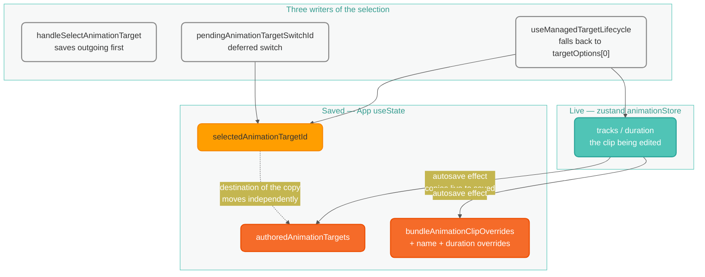
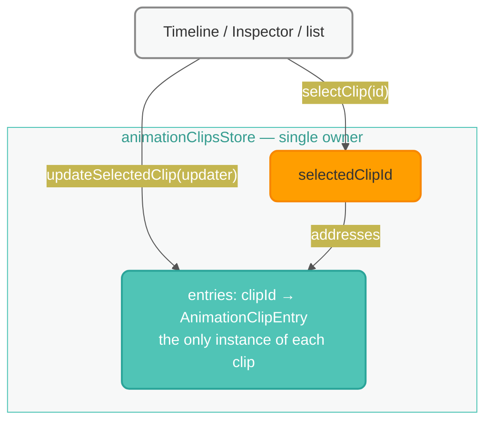
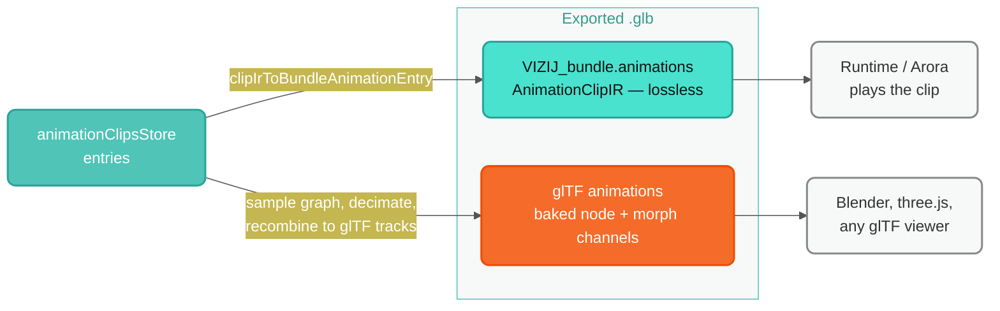

# Animation clip state: before and after

Companion to `ANIMATION_SELECTION_STATE_2026-09-03.md`, which traces the bugs.
This shows the shape that produced them and the shape replacing it, and — since
it is the question that matters most — where clips end up when you save.

## Before: two stores, reconciled by an effect

The dotted edge is the defect. The autosave copies **live to saved**, but the
_destination_ of that copy is read from the selection — which three different
code paths move, on their own schedules. Any moment where selection and live
contents disagree writes the wrong clip:

| Disagreement                                        | Symptom                                      |
| --------------------------------------------------- | -------------------------------------------- |
| selection moved before the load                     | new clip receives the previous clip's tracks |
| store emptied before selection caught up            | every clip drops to 0 tracks                 |
| destination resolved to a clip you were not editing | "nothing saves"                              |

## After: one store, no copy

There is no copy to misroute. Edits address `selectedClipId` from inside the
store and selection changes are one `set()`, so no render can observe selection
and data referring to different clips. The autosave effect, the hydration
marker, save-before-switch and the deferred-switch dance all become unnecessary
rather than needing to be made correct.

## Where clips go when you save

Unchanged by the refactor — this is the contract the port has to keep.

Clips are written **twice, deliberately**, and the two are not redundant:

- **`VIZIJ_bundle.animations`** — the authored `AnimationClipIR`, lossless, with
  per-key interpolation and tangents intact. This is what the runtime loads and
  what round-trips back into this app. Confirmed present in a shipped asset:
  `Quori_Current_Extended.glb` carries
  `animations: [authoring.timeline.clip.1, authoring.timeline.main]`.
- **glTF `animations`** — baked node and morph channels, so Blender or any glTF
  viewer sees the motion. Lossy by nature: material channels have no glTF
  equivalent, and clips driving abstract rig inputs must be evaluated through
  the rig graph to become node motion.

Path in code: `authoredAnimationClips` → `clipIrToBundleAnimationEntry` →
merged with inherited imported entries → `bundle.animations` →
`applyVizijBundle` → the `VIZIJ_bundle` extension; and separately
`bakeAuthoredClips` → `exportScene({ animations })`.

### Two things the port must preserve

1. **Feed the export from `entries`.** `authoredAnimationClips` currently comes
   from a memo that includes imported clips only when they carry edits, with
   the rest inherited separately. With provenance on the entry, that becomes
   "emit every entry", and `source` decides whether an unedited import is
   inherited or re-emitted.
2. **Empty clips are dropped on export today** — `authoredAnimationEntries`
   filters `tracks.length > 0`. So a clip created and never keyed does not
   survive a save/reload. Defensible, but it should be a decision rather than a
   side effect of a filter; worth surfacing in the export preflight.
