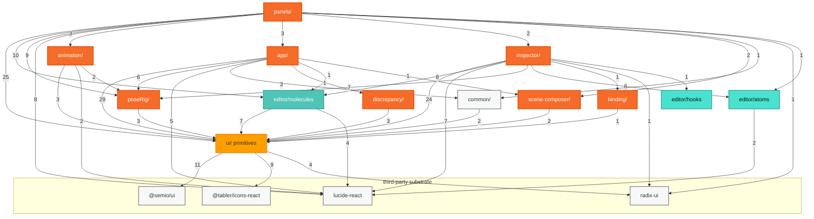

# Component import graph

Two generated views of what imports what under `src/components`, produced by
static analysis rather than by hand — so they cannot drift from the code.
Both diagrams below are generated; regenerate them in place with:

```bash
pnpm --filter vizij-authoring graph:components
```

## Layers — the architecture check

Every edge aggregated to layer granularity. This answers whether the `ui/` →
`editor/` → feature direction actually holds. Read it top-down; every edge
should point downward, and any edge that does not is a layering violation.

<!-- BEGIN GENERATED layers -- node scripts/component-graph.mjs layers --into <this file> -->



<!-- END GENERATED layers -->

## Detail — the packaging check

Per-component nodes for the three _portable_ layers (`ui/`, `editor/`,
`common/`) and the edges between them. It shows exactly which primitives a
reusable component drags along with it, which is the thing you need to know
before extracting one.

Edge labels are import-statement counts. A **dashed** edge is one reached
through the `ui/` barrel rather than imported directly. `←N` in a node label is
the number of distinct feature-code files importing that component — a fan-in
count, not drawn as edges.

```mermaid
flowchart LR
  subgraph external_g["third-party substrate"]
    lucide["lucide-react"]
    semio_ui["@semio/ui"]
    tabler["@tabler/icons-react"]
    radix_ui["radix-ui"]
  end
  subgraph ui_g["ui/ — app primitives on @semio/ui"]
    ui__Button["Button<br/>←41"]
    ui__Modal["Modal<br/>←8"]
    ui__MenuBar["MenuBar<br/>←1"]
    ui__ThemeToggle["ThemeToggle<br/>←1"]
    ui__Panel["Panel<br/>←9"]
    ui__Input["Input<br/>←12"]
    ui__Switch["Switch<br/>←4"]
    ui__Card["Card<br/>←6"]
    ui__FieldRow["FieldRow<br/>←2"]
    ui__ListRow["ListRow<br/>←3"]
    ui__Chip["Chip<br/>←11"]
    ui__Tabs["Tabs<br/>←4"]
    ui__Select["Select<br/>←9"]
    ui__RowSlider["RowSlider<br/>←1"]
    ui__TextArea["TextArea<br/>←4"]
    ui__Combobox["Combobox<br/>←2"]
    ui__CollapsibleRow["CollapsibleRow<br/>←3"]
    ui__Checkbox["Checkbox<br/>←1"]
    ui__CollapsibleGroup["CollapsibleGroup<br/>←3"]
    ui__Slider["Slider<br/>←4"]
    ui__TreeRow["TreeRow<br/>←5"]
    ui__Badge["Badge<br/>←2"]
    ui__Tooltip["Tooltip<br/>←1"]
    ui__NumberField["NumberField<br/>←4"]
    ui__EmptyState["EmptyState<br/>←5"]
    ui__PanelSearch["PanelSearch<br/>←4"]
    ui__TreeRoot["TreeRoot<br/>←1"]
    ui__Logo["Logo"]
    ui__sliderDefaultBehavior["sliderDefaultBehavior"]
  end
  subgraph editor_atoms_g["editor/atoms"]
    editor_atoms__ChannelLockButton["ChannelLockButton<br/>←4"]
    editor_atoms__ChannelLockStrip["ChannelLockStrip<br/>←2"]
    editor_atoms__RowCheckbox["RowCheckbox<br/>←1"]
  end
  subgraph editor_hooks_g["editor/hooks"]
    editor_hooks__useRowLock["useRowLock<br/>←1"]
  end
  subgraph editor_molecules_g["editor/molecules"]
    editor_molecules__WorkbenchPanel["WorkbenchPanel<br/>←6"]
    editor_molecules__ControlRow["ControlRow<br/>←2"]
    editor_molecules__GroupedInputTree["GroupedInputTree<br/>←1"]
    editor_molecules__InspectorSection["InspectorSection<br/>←2"]
    editor_molecules__MergeValueField["MergeValueField<br/>←1"]
    editor_molecules__ModalFormGroup["ModalFormGroup<br/>←1"]
    editor_molecules__PropertyGrid["PropertyGrid<br/>←2"]
    editor_molecules__PropertyRow["PropertyRow<br/>←4"]
  end
  subgraph common_g["common/"]
    common__InstructionCallout["InstructionCallout<br/>←2"]
    common__SidebarSection["SidebarSection<br/>←2"]
  end

  common__InstructionCallout -->|1| ui__CollapsibleGroup
  common__SidebarSection -->|1| ui__CollapsibleGroup
  editor_atoms__ChannelLockButton -->|1| lucide
  editor_atoms__ChannelLockStrip -->|1| lucide
  editor_molecules__ControlRow -->|1| lucide
  editor_molecules__ControlRow -->|1| ui__Slider
  editor_molecules__GroupedInputTree -->|1| lucide
  editor_molecules__GroupedInputTree -->|1| ui__TreeRow
  editor_molecules__GroupedInputTree -->|1| editor_molecules__ControlRow
  editor_molecules__MergeValueField -->|1| ui__Button
  editor_molecules__PropertyRow -->|1| lucide
  editor_molecules__PropertyRow -->|1| ui__Button
  editor_molecules__WorkbenchPanel -->|1| lucide
  editor_molecules__WorkbenchPanel -->|1| ui__Badge
  editor_molecules__WorkbenchPanel -->|1| ui__Button
  editor_molecules__WorkbenchPanel -->|1| ui__Tooltip
  ui__Button -->|1| semio_ui
  ui__Checkbox -->|1| semio_ui
  ui__CollapsibleGroup -->|1| semio_ui
  ui__CollapsibleGroup -->|1| tabler
  ui__CollapsibleRow -->|1| semio_ui
  ui__CollapsibleRow -->|1| tabler
  ui__CollapsibleRow -->|1| ui__RowSlider
  ui__Combobox -->|1| semio_ui
  ui__Combobox -->|1| tabler
  ui__Input -->|1| semio_ui
  ui__MenuBar -->|1| radix_ui
  ui__MenuBar -->|1| tabler
  ui__MenuBar -->|1| ui__Logo
  ui__Modal -->|1| radix_ui
  ui__Modal -->|1| tabler
  ui__Modal -->|1| ui__Button
  ui__NumberField -->|1| semio_ui
  ui__NumberField -->|1| tabler
  ui__Panel -->|1| tabler
  ui__Panel -->|1| ui__Badge
  ui__Panel -->|1| ui__Tooltip
  ui__PanelSearch -->|1| tabler
  ui__PanelSearch -->|1| ui__Input
  ui__RowSlider -->|1| ui__Input
  ui__RowSlider -->|1| ui__sliderDefaultBehavior
  ui__Select -->|1| semio_ui
  ui__Slider -->|1| radix_ui
  ui__Slider -->|1| ui__sliderDefaultBehavior
  ui__Switch -->|1| semio_ui
  ui__Tabs -->|1| radix_ui
  ui__TextArea -->|1| semio_ui
  ui__ThemeToggle -->|1| tabler
  ui__Tooltip -->|1| semio_ui
  ui__TreeRow -->|1| ui__TreeRoot

  classDef primary fill:#50C4B6,stroke:#2AA499,color:#FFFFFF,stroke-width:2px
  classDef secondary fill:#F56B29,stroke:#EC4D00,color:#FFFFFF,stroke-width:2px
  classDef highlight fill:#FF9E00,stroke:#F78600,color:#333333,stroke-width:2px
  classDef neutral fill:#F7F8F8,stroke:#888888,color:#333333,stroke-width:2px
  classDef emphasis fill:#48E2CE,stroke:#2AA499,color:#111111,stroke-width:2px
  class lucide neutral
  class semio_ui neutral
  class tabler neutral
  class radix_ui neutral
  class ui__Button highlight
  class ui__Modal highlight
  class ui__MenuBar highlight
  class ui__ThemeToggle highlight
  class ui__Panel highlight
  class ui__Input highlight
  class ui__Switch highlight
  class ui__Card highlight
  class ui__FieldRow highlight
  class ui__ListRow highlight
  class ui__Chip highlight
  class ui__Tabs highlight
  class ui__Select highlight
  class ui__RowSlider highlight
  class ui__TextArea highlight
  class ui__Combobox highlight
  class ui__CollapsibleRow highlight
  class ui__Checkbox highlight
  class ui__CollapsibleGroup highlight
  class ui__Slider highlight
  class ui__TreeRow highlight
  class ui__Badge highlight
  class ui__Tooltip highlight
  class ui__NumberField highlight
  class ui__EmptyState highlight
  class ui__PanelSearch highlight
  class ui__TreeRoot highlight
  class ui__Logo highlight
  class ui__sliderDefaultBehavior highlight
  class editor_atoms__ChannelLockButton emphasis
  class editor_atoms__ChannelLockStrip emphasis
  class editor_atoms__RowCheckbox emphasis
  class editor_hooks__useRowLock emphasis
  class editor_molecules__WorkbenchPanel primary
  class editor_molecules__ControlRow primary
  class editor_molecules__GroupedInputTree primary
  class editor_molecules__InspectorSection primary
  class editor_molecules__MergeValueField primary
  class editor_molecules__ModalFormGroup primary
  class editor_molecules__PropertyGrid primary
  class editor_molecules__PropertyRow primary
  class common__InstructionCallout neutral
  class common__SidebarSection neutral
```

<!-- BEGIN GENERATED detail -- node scripts/component-graph.mjs detail --into <this file> -->



<!-- END GENERATED detail -->

Feature-code consumers are deliberately **not drawn** in the detail view. 48
files importing 27 primitives renders as a 12,000px-wide hairball, and the layers
view already summarises that direction. The information survives as the `←N`
count in each node's label: the number of distinct feature files importing it.

## What the current graph says

- **The layering holds.** No edge runs from `ui/` or `editor/` up into feature
  code. The two cross-layer edges inside the portable set —
  `editor/molecules/WorkbenchPanel` → `ui/` (Badge, Button, Tooltip) and
  `common/SidebarSection` → `ui/CollapsibleGroup` — both point the right way.
- **`Button ←39` is the load-bearing primitive**, followed by `Input ←12`,
  `Chip ←11`, `Select ←9`, `Panel ←9`. Any change to `Button` is an app-wide
  change; this is why it got its own migration phase.
- **Two feature files import `radix-ui` directly** —
  `inspector/RiggingMaterialSection.tsx` and `panels/HierarchyPanel.tsx`,
  bypassing the primitive layer. Those are the two Popovers converted during the
  Base UI removal. Not wrong, but they are the only feature-level dependency on
  the primitive substrate, and they would block extracting those files as-is.
- **`lucide-react` is still reached from `ui/` in 4 places.** The plan is to move
  `ui/`'s icons to `@tabler/icons-react` (already used in 5) and leave feature-code
  lucide alone, so those 4 edges are the remaining work, not the whole 36.

## Reading caveats

- `*.stories.tsx` and `*.test.tsx` are excluded. They import downward by
  definition and would imply runtime dependencies that do not exist.
- Edge labels are **import-statement counts, not call-site counts**. A file that
  imports `Button` once and renders it 40 times contributes 1.
- Barrel imports (`from "../ui"`) are attributed to the file that actually owns
  each imported symbol, via an exported-symbol table — `ui/index.ts` is
  `export *` only, so without that table every barrel import would fan out to all
  27 primitives. Barrel-derived edges are drawn **dashed**.
- The analyser is regex-based, not a TypeScript program. It is accurate for this
  codebase's import style; it would need real parsing for dynamic `import()` or
  `require`.
