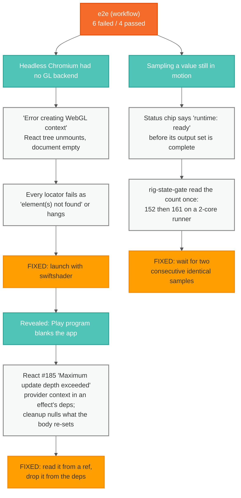
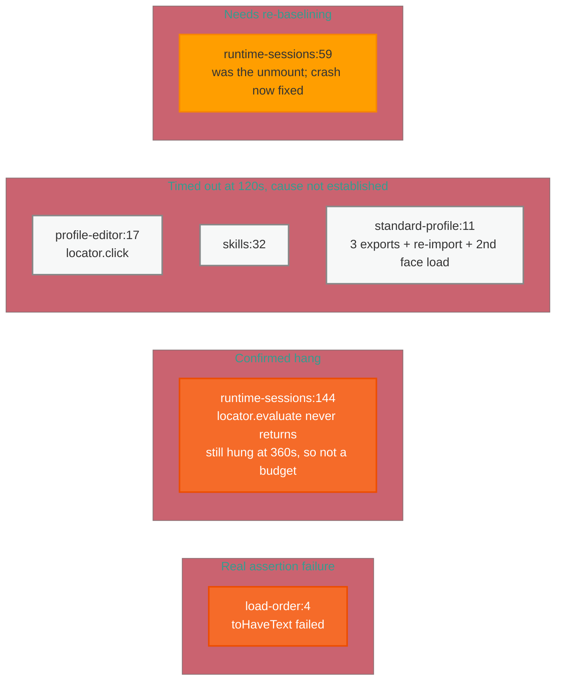

# The `workflow` e2e failures, and what is actually wrong

The `e2e (workflow)` CI job has been red since it was introduced. Six specs
fail, and they failed the same way on this branch's other parent (PR #113)
before the two branches were stacked — so none of them is a regression from
the animation/transport work.

They are not one problem. Three distinct causes have been established by
measurement, and each hid the next: with no GL backend the app unmounted, and
only once it stayed mounted did the render loop appear.

## What was found

Fixing the first two cleared none of the six. They were real bugs — the
Play-program crash blanks the app in a real browser too — but adjacent to the
specs rather than under them.

## The six, and what is known about each

## How to work these

Three misdiagnoses on `rig-state-gate` alone are the reason for writing this
down. It was read first as a stale hardcoded baseline (the test hardcodes
nothing), then as a real regression in clip seeding (the counts turned out
equal), before measurement showed the test was sampling a value in motion.

What produced answers:

- Capture `page.on("console")` and `page.on("pageerror")` in the spec; filter
  WebGL noise and dedupe. Several "element not found" failures were the React
  tree unmounting from an uncaught error.
- Run against dev for unminified React errors:
  `VIZIJ_E2E_SERVER_MODE=dev npx playwright test <spec> --project=workflow --workers=1`.
  The default preview build reports `Minified React error #185` and nothing else.
- When a locator fails, check the app is still alive:
  `(await page.locator("body").innerText()).length`. Zero means the failure is
  a symptom.
- Read `test-results/<dir>/test-failed-1.png`. A blank frame means it died.
- Suspect a value still settling before asserting on it.
- Iterate on a throwaway `e2e/zz-diag.pw.ts`, then delete it.

Two constraints:

- **One Playwright run at a time**, `--workers=1`. Each test boots a WASM
  runtime and a large GLB face; concurrent runs exhaust memory and fail for
  contention, indistinguishable from a real failure. This is why the config
  pins `workers: 1`.
- **`react-hooks/exhaustive-deps` is off repo-wide**, so nothing catches a
  dependency that changes every render — the shape behind both crashes above.

## Rules for changing anything here

Never weaken an assertion to make a spec pass; if the assertion is right and
the app is wrong, fix the app. Mutation-check every change: revert the fix,
confirm the test fails, restore it, confirm it passes. A test that passes
either way is worth nothing, and three tests written today passed against the
bug they were meant to catch.
