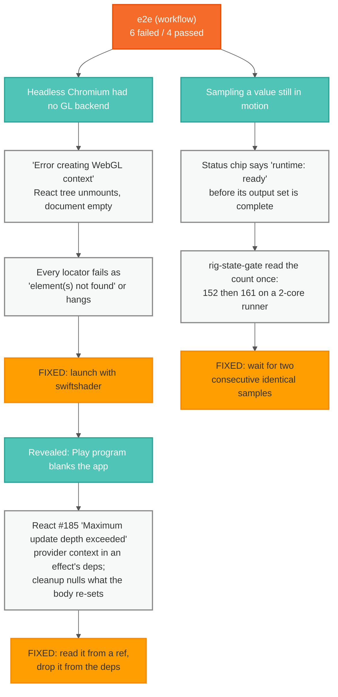
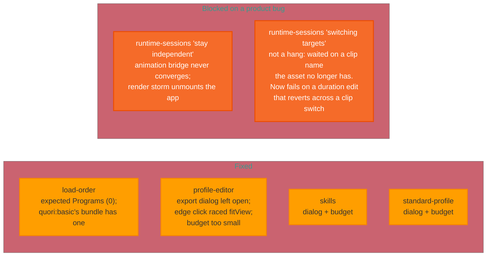

# The `workflow` e2e failures, and what is actually wrong

The `e2e (workflow)` CI job has been red since it was introduced. Six specs
fail, and they failed the same way on this branch's other parent (PR #113)
before the two branches were stacked — so none of them is a regression from
the animation/transport work.

They are not one problem. Seven distinct causes have been established by
measurement, and each hid the next: with no GL backend the app unmounted, and
only once it stayed mounted did the render loop appear. Four of the six are
now fixed; the two `runtime-sessions` specs are blocked on a product bug in
animation clip/runtime ownership.

## What was found

Fixing the first two cleared none of the six. They were real bugs — the
Play-program crash blanks the app in a real browser too — but adjacent to the
specs rather than under them.

## The six, and what is known about each

## The four causes found under the six

Established by measurement, in the order the specs were worked.

**The asset drifted out from under the tests.** `Quori_Current_Extended.glb`
was re-exported (bundle `exportedAt` 2026-03-14) and its contents changed
names. Reading the GLB's JSON chunk directly:

| preset | file | animations | motiongraphs |
| --- | --- | --- | --- |
| `quori:basic` | `Quori_Current.glb` | 0 | `motiongraph` |
| `quori:latest` | `Quori_Current_Extended.glb` | `Nonesense`, `Stages` | `Speaks`, `Live` |

`load-order` asserted `Programs (0)` after selecting `quori:basic`, but that
preset ships one embedded motiongraph — the app was right and the expectation
stale, and the late `quori:latest` response had never leaked in. Both
`runtime-sessions` specs asked for `New Animation Clip` and `New Procedural
Program`, which no longer exist. That is what read as a hang: `locator.evaluate`
waits on its locator with no timeout of its own, so it consumed the whole
budget — raising the timeout to 360s only hung for 360s. All of these now read
the names off the panel rows.

**The modal backdrop now covers the menubar, and the export dialog stays
open.** 92b3d7f4 moved `Modal` onto radix and lifted overlays to `z-[4100]`
deliberately, so a modal covers the application instead of leaving the menubar
clickable behind it. `exportGlb` never closed the dialog, so every later `File`
menu click retried to the timeout against
`
 intercepts pointer events`. This alone
accounts for `profile-editor`, `skills` and `standard-profile`.

**A GLB export blocks for ~29 seconds.** Measured as the gap between the
`export-glb:pose-graph-validate` and `export-glb:bake` log lines, with the
runtime noticing it afterwards: "step loop woke after a 28.7s wall-clock gap".
One export puts `profile-editor` at ~116s of the 120s budget; the two
four-export specs need ~2 minutes of baking. Their per-test timeouts are now
sized to the measurement. The bake itself is a real performance problem and is
untouched.

**Two clicks that were never going to land.** `EditorCanvas` runs
`fitView({ duration: 260 })` on the rAF after its nodes appear, and
`click({ force: true })` skips Playwright's wait-for-stable — the viewport
transform was caught moving across the click
(`translate(34.6px, 150.2px) scale(1.33)` to
`translate(78.7px, 66.8px) scale(1.16)`), so the click missed the edge and
selected nothing. Separately, `animation-panel button[title="Stop"] + button`
was Play when written; the row is now Stop / Step back / Play / Step forward,
so the click hit "Step back one frame" and the chip stayed "Runtime: Idle".
And on macOS Chromium `Control+A` is move-to-line-start, not select-all, so
typing over a duration left `12.55` behind. (That last one only bites locally;
Linux CI would have passed it.)

## What is left, and why it is not a test fix

Both remaining failures are in animation clip/runtime ownership.

`AnimationRuntimeBridge`'s second effect — the one commented "retry bundle
application until runtime state converges" — never converges after a clip
switch. Its `[timeline][animation-bridge] apply animations` log fires 26 times
in four seconds against 1-2 normally, and the logged pairs show the runtime
reporting `authoring.timeline.main` with `tracks: []` while the merged bundle
has it with four. Each `setGraphBundle` changes the runtime signature, which
clears `appliedAnimationSignatureRef`, which permits another apply. The
nested-update storm ends in "Maximum update depth exceeded" and an unmounted
tree; the captured throw is `setRuntimeTransportAdapter` from the adapter
effect's cleanup, which writes state in both its cleanup and its body and so
amplifies the storm rather than causing it. Note this is a *second* loop in
that effect — 86a3eaac fixed a different one (the `runtime` context object in
its deps).

The other spec's last assertion fails on its own: a duration edit of 12.5
lands (the field holds it) and reverts to 10 after switching clips away and
back, even though `handleUpdateAnimationTargetDuration` writes an imported
clip's duration through `updateClipInStore`.

## How to work these

Three misdiagnoses on `rig-state-gate` alone are the reason for writing this
down. It was read first as a stale hardcoded baseline (the test hardcodes
nothing), then as a real regression in clip seeding (the counts turned out
equal), before measurement showed the test was sampling a value in motion.

What produced answers:

- Capture `page.on("console")` and `page.on("pageerror")` in the spec; filter
  WebGL noise and dedupe. Several "element not found" failures were the React
  tree unmounting from an uncaught error.
- Run against dev for unminified React errors:
  `VIZIJ_E2E_SERVER_MODE=dev npx playwright test <spec> --project=workflow --workers=1`.
  The default preview build reports `Minified React error #185` and nothing else.
- When a locator fails, check the app is still alive:
  `(await page.locator("body").innerText()).length`. Zero means the failure is
  a symptom.
- Read `test-results/<dir>/test-failed-1.png`. A blank frame means it died.
- Suspect a value still settling before asserting on it.
- Iterate on a throwaway `e2e/zz-diag.pw.ts`, then delete it.

Two constraints:

- **One Playwright run at a time**, `--workers=1`. Each test boots a WASM
  runtime and a large GLB face; concurrent runs exhaust memory and fail for
  contention, indistinguishable from a real failure. This is why the config
  pins `workers: 1`.
- **`react-hooks/exhaustive-deps` is off repo-wide**, so nothing catches a
  dependency that changes every render — the shape behind both crashes above.

## Rules for changing anything here

Never weaken an assertion to make a spec pass; if the assertion is right and
the app is wrong, fix the app. Mutation-check every change: revert the fix,
confirm the test fails, restore it, confirm it passes. A test that passes
either way is worth nothing, and three tests written today passed against the
bug they were meant to catch.
