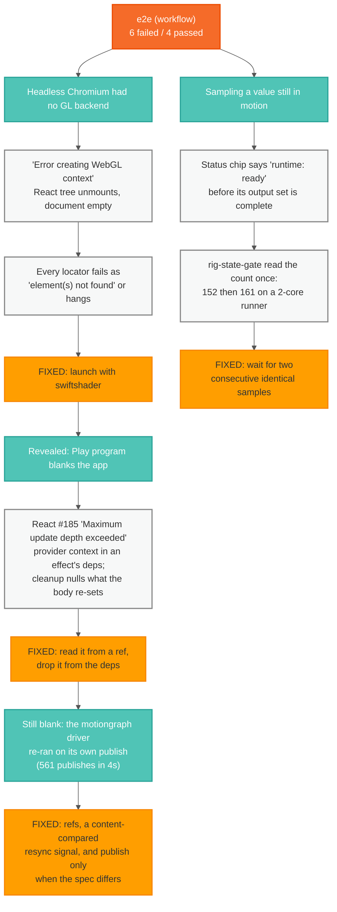
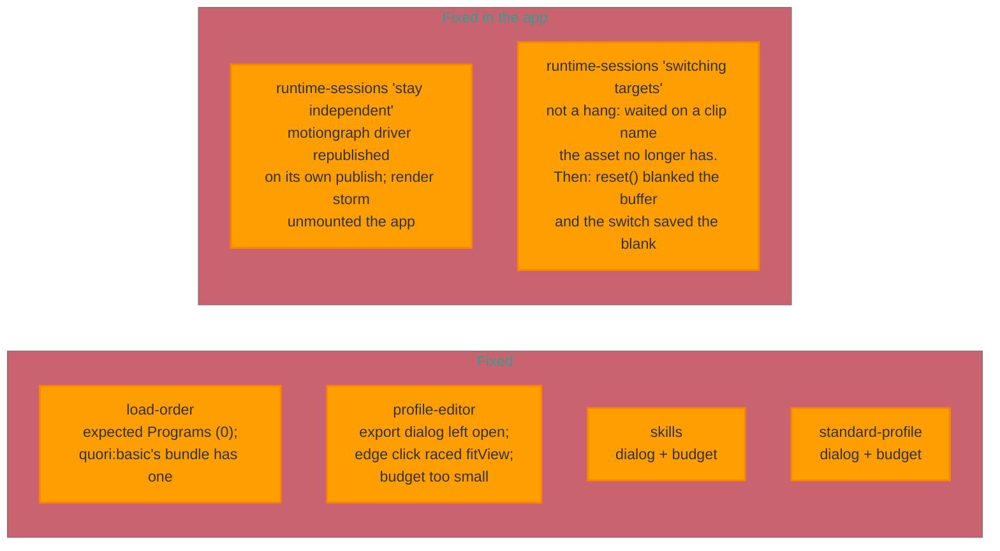

# The `workflow` e2e failures, and what is actually wrong

The `e2e (workflow)` CI job has been red since it was introduced. Six specs
fail, and they failed the same way on this branch's other parent (PR #113)
before the two branches were stacked — so none of them is a regression from
the animation/transport work.

They are not one problem. Nine distinct causes have been established by
measurement, and each hid the next: with no GL backend the app unmounted, and
only once it stayed mounted did the render loop appear. All six now pass —
four were test bugs, and the two `runtime-sessions` specs were product bugs in
motiongraph publishing and in animation clip ownership.

## What was found



Fixing the first two cleared none of the six. They were real bugs — the
Play-program crash blanks the app in a real browser too — but adjacent to the
specs rather than under them.

## The six, and what is known about each



## The four causes found under the six

Established by measurement, in the order the specs were worked.

**The asset drifted out from under the tests.** `Quori_Current_Extended.glb`
was re-exported (bundle `exportedAt` 2026-03-14) and its contents changed
names. Reading the GLB's JSON chunk directly:

| preset         | file                         | animations            | motiongraphs     |
| -------------- | ---------------------------- | --------------------- | ---------------- |
| `quori:basic`  | `Quori_Current.glb`          | 0                     | `motiongraph`    |
| `quori:latest` | `Quori_Current_Extended.glb` | `Nonesense`, `Stages` | `Speaks`, `Live` |

`load-order` asserted `Programs (0)` after selecting `quori:basic`, but that
preset ships one embedded motiongraph — the app was right and the expectation
stale, and the late `quori:latest` response had never leaked in. Both
`runtime-sessions` specs asked for `New Animation Clip` and `New Procedural
Program`, which no longer exist. That is what read as a hang: `locator.evaluate`
waits on its locator with no timeout of its own, so it consumed the whole
budget — raising the timeout to 360s only hung for 360s. All of these now read
the names off the panel rows.

**The modal backdrop now covers the menubar, and the export dialog stays
open.** 92b3d7f4 moved `Modal` onto radix and lifted overlays to `z-[4100]`
deliberately, so a modal covers the application instead of leaving the menubar
clickable behind it. `exportGlb` never closed the dialog, so every later `File`
menu click retried to the timeout against
`<div class="fixed inset-0 z-[4100] …"> intercepts pointer events`. This alone
accounts for `profile-editor`, `skills` and `standard-profile`.

**A GLB export blocks for ~29 seconds.** Measured as the gap between the
`export-glb:pose-graph-validate` and `export-glb:bake` log lines, with the
runtime noticing it afterwards: "step loop woke after a 28.7s wall-clock gap".
One export puts `profile-editor` at ~116s of the 120s budget; the two
four-export specs need ~2 minutes of baking. Their per-test timeouts are now
sized to the measurement. The bake itself is a real performance problem and is
untouched.

**Two clicks that were never going to land.** `EditorCanvas` runs
`fitView({ duration: 260 })` on the rAF after its nodes appear, and
`click({ force: true })` skips Playwright's wait-for-stable — the viewport
transform was caught moving across the click
(`translate(34.6px, 150.2px) scale(1.33)` to
`translate(78.7px, 66.8px) scale(1.16)`), so the click missed the edge and
selected nothing. Separately, `animation-panel button[title="Stop"] + button`
was Play when written; the row is now Stop / Step back / Play / Step forward,
so the click hit "Step back one frame" and the chip stayed "Runtime: Idle".
And on macOS Chromium `Control+A` is move-to-line-start, not select-all, so
typing over a duration left `12.55` behind. (That last one only bites locally;
Linux CI would have passed it.)

## The two product bugs under `runtime-sessions`

Both were measured, not reasoned about. An earlier written-up diagnosis —
`AnimationRuntimeBridge`'s retry effect never converging, applying its bundle
26 times — did not survive instrumentation: the bridge applies **three** times
across the whole spec, and the storm belongs to the motiongraph driver.

**Playing a program republished it, forever.** With a CDP profile across the
Play-program click, plus a deduped console capture: `Published program` and
`Cleaned up program on unmount` each logged 561 times in four seconds, the
runtime re-registered its graphs 579 times, and `glbSignature` /
`resolveRuntimeUpdatePlan` (i.e. `setGraphBundle`) dominated the profile.
Three separate feedback paths, each removed and then measured again:

| what changed identity             | why it re-ran the driver                                                                                                                             | publishes left |
| --------------------------------- | ---------------------------------------------------------------------------------------------------------------------------------------------------- | -------------- |
| `stopProgram`                     | memoized on `assetBundle.programs`, which a publish replaces — and it was a dependency of the _unmount_ cleanup, so publishing tore the program down | 561 → 54       |
| `controllers` (the resync signal) | `listControllers()` rebuilds it whenever the provider refreshes status, which a publish causes                                                       | —              |
| the editor's node array           | React Flow writes a measured dimension back through `onNodesChange` on re-render                                                                     | 54 → 2         |

The fix reads the runtime's methods from refs, compares the resync signal by
content, and publishes only when the built spec differs from the last one
published. Note the shape: three different objects whose identity changed for
reasons unrelated to their content, in a hook whose effects wrote runtime
state. `react-hooks/exhaustive-deps` is off, so nothing flagged any of them.

Separately, and visible in the same trace: React Flow's measured `width`,
`height`, `positionAbsolute` and selection state were part of the program
snapshot, so each of the ~250 per-node measurements looked like an author edit
and wrote a new `bundleProceduralSnapshotOverrides` object — a full app
re-render each. Those fields are stripped from the snapshot now. The spec
passes without that change, so it is covered by unit tests rather than by it.

**A duration edit reverted because a blank buffer was saved over it.** The
store's own trace shows the whole sequence:

```
handleUpdateDuration  entry=clip.1 next=12.5
updateClip            clip.1 duration 5 -> 12.5
saveAnimationTarget   bufferDuration=12.5  entryDuration=12.5
duration              12.5 -> 10                      <- reset()
selectClip            -> main; outgoing=clip.1 bufferDuration=10
```

`handleSelectAnimationTarget` saves the outgoing clip, then calls `reset()` to
unload the transport before the next clip loads. `reset()` keeps
`selectedClipId` on purpose — App derives the selected target from it — so it
leaves a blank buffer filed against a clip that has real data, and the
`selectClip` 118ms later materialised that blank into the outgoing entry. The
`10` was never the runtime's: it is `INITIAL_STATE.duration`.

The store now tracks whether the buffer still holds the selected clip's data;
`selectClip` commits the outgoing entry only when it does, and `getAllClips`
— the export read path — likewise will not ship a discarded buffer as a clip.
That second half matters beyond the test: export would otherwise have shipped
the selected clip empty after any reset.

## How to work these

Three misdiagnoses on `rig-state-gate` alone are the reason for writing this
down. It was read first as a stale hardcoded baseline (the test hardcodes
nothing), then as a real regression in clip seeding (the counts turned out
equal), before measurement showed the test was sampling a value in motion.

What produced answers:

- Capture `page.on("console")` and `page.on("pageerror")` in the spec; filter
  WebGL noise and dedupe. Several "element not found" failures were the React
  tree unmounting from an uncaught error.
- Run against dev for unminified React errors:
  `VIZIJ_E2E_SERVER_MODE=dev npx playwright test <spec> --project=workflow --workers=1`.
  The default preview build reports `Minified React error #185` and nothing else.
- When a locator fails, check the app is still alive:
  `(await page.locator("body").innerText()).length`. Zero means the failure is
  a symptom.
- Read `test-results/<dir>/test-failed-1.png`. A blank frame means it died.
- Suspect a value still settling before asserting on it.
- Iterate on a throwaway `e2e/zz-diag.pw.ts`, then delete it.
- Count console messages instead of reading them. `page.on("console")` into a
  `Map<first 120 chars, count>`, printed by frequency, named the looping
  component in one run — 561 publishes and 561 teardowns, against 19 of
  everything else.
- Profile the page over the moment it dies. `page.context().newCDPSession`,
  then `Profiler.enable` / `Profiler.start` / `Profiler.stop`, and sum
  `hitCount` by call frame. That is what identified `setGraphBundle` as the
  thing being called hundreds of times, rather than anything the failure text
  mentioned. It also tells a jammed main thread from an unmounted tree: a
  `page.evaluate` racing a 3s timer times out for the first and returns for
  the second.
- For a suspected dependency loop, log _which_ dependency changed: keep the
  previous values in a ref and diff by identity at the top of the effect.
  Reading the deps list will not tell you; two of the three churning objects
  here looked stable.

Two constraints:

- **One Playwright run at a time**, `--workers=1`. Each test boots a WASM
  runtime and a large GLB face; concurrent runs exhaust memory and fail for
  contention, indistinguishable from a real failure. This is why the config
  pins `workers: 1`.
- **`react-hooks/exhaustive-deps` is off repo-wide**, so nothing catches a
  dependency that changes every render — the shape behind both crashes above.

## Rules for changing anything here

Never weaken an assertion to make a spec pass; if the assertion is right and
the app is wrong, fix the app. And do not build on a written-up diagnosis
without re-measuring it: the one recorded here for "stay independent" pointed
at the wrong component, and instrumenting the bridge it accused took ten
minutes to disprove. Mutation-check every change: revert the fix,
confirm the test fails, restore it, confirm it passes. A test that passes
either way is worth nothing, and three tests written today passed against the
bug they were meant to catch.
