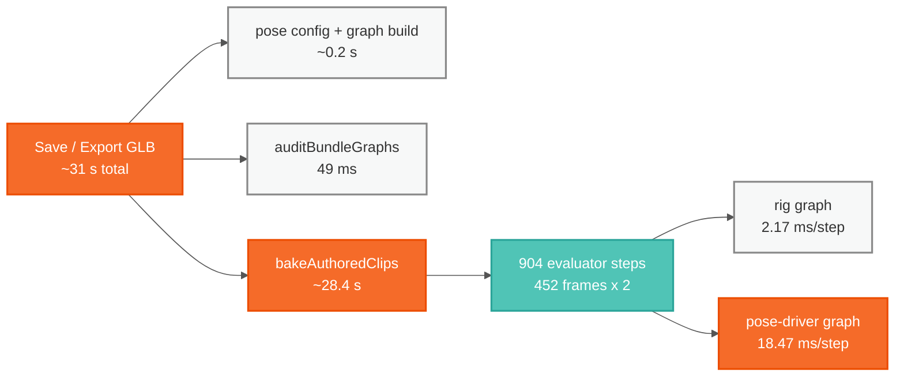

# Why a GLB export freezes the app for 29 seconds

Saving the extended Quori face blocks the browser's main thread for about 29
seconds, with no progress indication. All of it is inside `bakeAuthoredClips`,
and effectively all of _that_ is one graph: the 317-node pose-driver.

Nothing here is fixed. This records what was measured so the next person does
not re-derive it, and what the options are.

## The measurement

Taken against the runtime directly, with the graph specs read out of the
shipped `Quori_Current_Extended.glb`, by
`src/animationBake/__tests__/bakeStepCost.device.test.ts`:

| spec                                          | nodes | per step     | per node   |
| --------------------------------------------- | ----- | ------------ | ---------- |
| rig alone (`quori_latest`)                    | 2116  | 2.17 ms      | ~1 µs      |
| pose-driver alone (`quori_latest_pose_graph`) | 317   | **18.47 ms** | **~58 µs** |
| composed, as the bake steps it                | 2433  | 23.67 ms     | —          |

The pose-driver graph costs **8.5× the rig graph with one seventh the nodes**,
roughly 60× per node.

The arithmetic closes: two clips at 30fps over 5s and 10s is 452 frames, and
`propagationTicks: 1` steps each frame twice, so 904 steps at ~23 ms is ~21
seconds — the rest is export scaffolding.

## What it is not

Four explanations were tested and ruled out. They are listed because each one
looked right from reading the code.

- **Not the bundle audit.** `auditBundleGraphs` recompiles every bundle graph's
  IR, which looks expensive and sits in the same unexplained span. It is
  **49 ms**. Timed in `5eb24175`, which left the log line in place.
- **Not the browser.** 23 ms/step measured in node matches what the browser
  spends per step, so there is nothing environmental to chase.
- **Not superlinear composition.** Composing 15% more nodes costing 9× looked
  like the merge itself was the problem; measuring each source alone shows the
  costs are additive. The pose-driver is simply expensive.
- **Not a remaining quadratic in the sampler.** `86a3eaac` memoized an O(n)
  `isSorted` that had made a sampler quadratic; profiling puts the current cost
  entirely in `evaluator.step()`, with `readOutputs` at ~0.25 ms and input
  staging free.

## This is not only an export problem

Playback steps the same composed graph every frame. An 18.5 ms pose-driver step
does not fit a 16 ms frame budget on its own, so whatever makes the bake slow
is also the ceiling on live frame rate. Fixing the graph helps both; fixing
only the bake helps one.

## Options, in descending value

1. **Make the pose-driver graph cheaper.** 58 µs per node against the rig's
   1 µs says its nodes are doing heavy work. It fans pose weights across every
   rig input, so a wide blend per node is the likely shape — see
   `src/poseRig/graphBuilder.ts`. This is the only option that also helps
   playback.
2. **Do not step it when the clip does not need it.**
   `authoring.timeline.clip.1` animates rig inputs (gaze, mouth);
   only `authoring.timeline.main` animates pose weights. For a clip of the
   first kind the pose graph contributes constants once settled, so it could be
   stepped to settle and then frozen. **Risk:** dropping it outright leaves
   pose-driven rig inputs at their defaults rather than their settled values,
   which changes baked output. Needs a per-clip decision and a test that
   compares baked values with and without.
3. **Yield between frames.** Does not reduce the 29 seconds, but ends the
   frozen main thread and allows progress reporting — the part a user
   experiences. `sampleClipThroughGraph` is synchronous today;
   `bakeAuthoredClips` is already async.

## Reproducing

- Per-step costs, no browser needed:
  `npx vitest run src/animationBake/__tests__/bakeStepCost.device.test.ts`
- End-to-end timings come from the app's own export logs
  (`export-glb:invoked` through `export-glb:export-scene`, plus
  `export-glb:bundle-audit`). The runtime confirms the main thread was blocked:
  it logs `step loop woke after a 28.7s wall-clock gap` immediately afterwards.

## Consequence already paid

Three e2e specs needed their per-test timeouts raised to fit the bake:
`skills` and `standard-profile` to 600 s (four exports each, `5a1de62d`), and
`profile-editor` to 300 s (one export, `e19b86c9`). Those raises are budget
sized to a measurement, not padding, and should come back down if the bake
gets faster.
