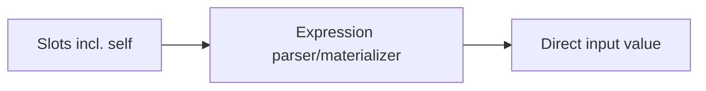
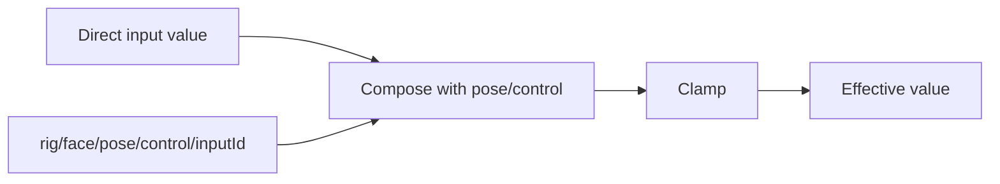
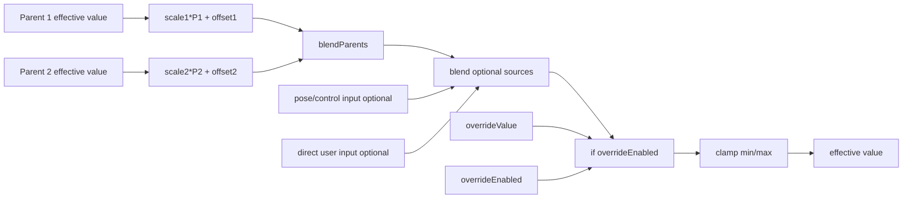
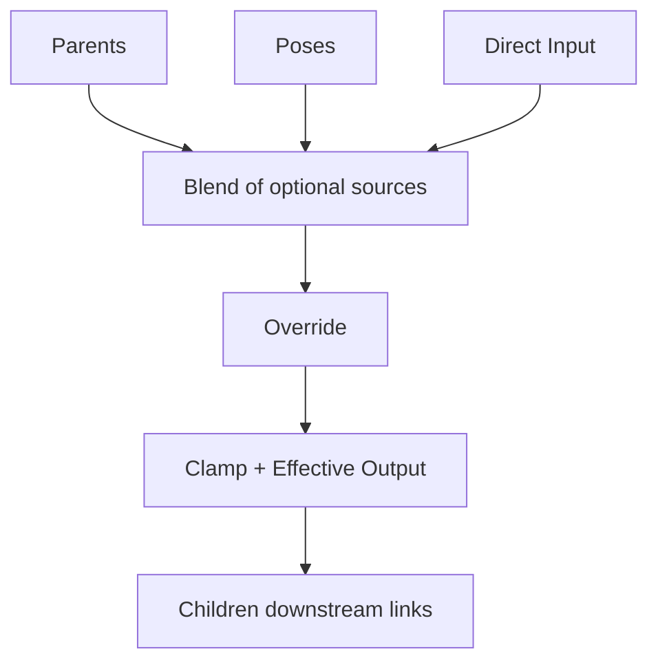
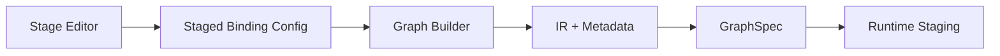

# Override Pipeline + Binding Editor Redesign Proposal (2026-02-25)

## 1) What You Want (Restated Precisely)

Target runtime equation per variable:

```text
effectiveValue = clamp(
  if(
    overrideEnabled,
    overrideValue,
    blend(parentContribution?, poseContribution?, directUserContribution?)
  )
)
```

with per-variable clamp toggle:

```text
effectiveValue = if(clampEnabled, clamp(selected), selected)
```

You also want:

1. Override controls on dedicated runtime paths.
2. A clear layer model:
   1. animatable properties (lowest level),
   2. autorig channels targeting animatable sub-properties,
   3. variable-level controls and blending (parents, poses, direct input).
3. Variable-level source inputs standardized and explicit:
   1. parent inputs (linked via binding expression),
   2. pose inputs (added as pose targets in that variable channel),
   3. explicit direct user input (opt-in, not auto-enabled).
4. Override controls (`overrideEnabled`, `overrideValue`) kept separate from source blending.
5. UI/inspector and binding editor redesigned so this full pipeline is obvious, including downstream children visibility.
6. Override logic should be compiler-injected, not authored directly in each binding expression.

**References**

- User requirements in this thread
- `packages/@vizij/node-graph-authoring/src/graphBuilder.ts:1496`
- `apps/vizij-authoring/src/poseRig/graphBuilder.ts:1090`

## ADR v1 (Locked Contract, 2026-02-25)

1. Migration and legacy policy:
   1. canonical legacy `self + parent(s)` bindings auto-migrate to staged config,
   2. legacy `self` is no longer a slot concept in staged mode; equivalent variable-local control is represented in the new override-aware staged semantics and exposed in inspector under direct-input settings (not "self slider"),
   3. non-convertible legacy expressions are flagged and kept read-only in a legacy section.
2. Direct vs override controls:
   1. `directInput.enabled` is compile-time metadata only,
   2. override enabled/value are runtime-stageable controls,
   3. neither direct-input nor override controls appear in Inputs pane; both are inspector settings.
3. Runtime path contract:
   1. direct value path remains existing variable input path (`rig/<face>/<input.path>`),
   2. no runtime direct-enabled path is introduced,
   3. override runtime paths are:
      1. `rig/<face>/override/<inputId>/enabled`,
      2. `rig/<face>/override/<inputId>/value`.
4. Blend and baseline:
   1. default `parentBlend` is `normalized-additive`,
   2. default `sourceBlend` is `normalized-additive`,
   3. baseline is always variable `defaultValue`.
5. Clamp policy:
   1. clamp is enabled by default for every variable,
   2. clamp is a per-variable setting,
   3. when clamp is disabled, output is intentionally unbounded.
6. Pose integration:
   1. existing pose compose behavior remains unchanged and produces `poseContribution`,
   2. staged source blend composes `parentContribution?`, `poseContribution?`, and `directContribution?`.
7. Parent expression scope:
   1. parent expression remains arbitrary authored math,
   2. `blendParents(...)` is the default authored template.
8. Metadata storage:
   1. staged pipeline config lives in `metadata.vizij.pipelineV1`,
   2. shared parent-child link params are stored once via deterministic `linkId` records.

## 2) What Exists Today (As-Is)

### 2.1 Parent bindings are expression-driven and often include `self`

Current parent-binding defaults inject `self` as the primary slot and canonical expression is alias-sum (`s1 + s2 + ...`). This is why direct control is currently represented as a slot contribution, not as a separate override stage.



**References**

- `packages/@vizij/node-graph-authoring/src/state.ts:225`
- `packages/@vizij/node-graph-authoring/src/state.ts:710`
- `apps/vizij-authoring/src/hooks/useBindingManager.ts:527`
- `apps/vizij-authoring/src/components/binding/BindingEditor.tsx:1043`

### 2.2 Pose/control is already a dedicated path

Pose graph emits `rig/<face>/pose/control/<inputId>`. Rig graph compiler then composes direct value with pose-control value and clamps.

Current compose stage uses existing modes (`add`, `average`) and normalization logic around input default baseline.



**References**

- `apps/vizij-authoring/src/poseRig/graphBuilder.ts:1090`
- `apps/vizij-authoring/src/poseRig/utils.ts:309`
- `packages/@vizij/node-graph-authoring/src/graphBuilder.ts:1483`
- `packages/@vizij/node-graph-authoring/src/graphBuilder.ts:1504`
- `packages/@vizij/node-graph-authoring/src/graphBuilder.ts:1562`

### 2.3 Export/IR metadata path exists and is extensible

Bindings and metadata are serialized in `metadata.vizij.*` and round-trip through IR compile/import. Existing binding summaries remain in `metadata.vizij.bindings`; staged pipeline config will live in `metadata.vizij.pipelineV1`.

**References**

- `packages/@vizij/node-graph-authoring/src/graphBuilder.ts:1906`
- `packages/@vizij/node-graph-authoring/src/graphBuilder.ts:1936`
- `apps/vizij-authoring/src/utils/graphImport.ts:63`
- `packages/@vizij/node-graph-authoring/src/ir/compiler.ts:45`

### 2.4 Verified current blend semantics (what we have today)

Variable-level blend in rig compiler (`direct` with `pose/control`):

1. supported modes today: `add`, `average`.
2. `average`: `(direct + poseControl) / 2`.
3. `add` is default and is normalized around input default baseline:
   1. compute `direct + poseControl`,
   2. subtract baseline (`input.defaultValue`),
   3. then clamp to input range.
4. compose is applied only for inputs that opt into compose mode and are not pose-weight or pose-control channels.

Pose-graph blending:

1. intra-group/stage modes today: additive and average.
2. average path uses weighted-aggregation nodes (`weightedsumvector` + `blendweightedaverageoverlay`) against neutral/base.
3. additive path sums deltas and applies back to neutral/base.
4. cross-group policy supports additive/average, with per-channel `priority` override.

Parent-expression blending:

1. no first-class parent blend operator/mode in current binding schema.
2. parent math is currently whatever authored expression evaluates to.

Direct user input channel today:

1. direct input value path is always materialized as the input node for a variable/input.
2. there is no first-class, per-variable `directInputEnabled` gate yet.
3. this is part of what the proposal changes, so direct input becomes explicit and opt-in.

**References**

- `packages/@vizij/node-graph-authoring/src/graphBuilder.ts:1483`
- `packages/@vizij/node-graph-authoring/src/graphBuilder.ts:1534`
- `packages/@vizij/node-graph-authoring/src/graphBuilder.ts:1548`
- `packages/@vizij/node-graph-authoring/src/graphBuilder.ts:1668`
- `packages/@vizij/node-graph-authoring/src/graphBuilder.ts:1677`
- `apps/vizij-authoring/src/poseRig/graphBuilder.ts:391`
- `apps/vizij-authoring/src/poseRig/graphBuilder.ts:462`
- `apps/vizij-authoring/src/poseRig/graphBuilder.ts:568`
- `apps/vizij-authoring/src/poseRig/types.ts:10`

## 3) Proposed Runtime Pipeline (To-Be)

## 3.1 Canonical staged pipeline

For each variable/input:

1. Parent Source Branch (optional):
   1. for each linked parent `p_i`: `t_i = p_i * scale_i + offset_i`.
   2. `p_i` is the **effective value** of that upstream variable (same full pipeline), so nesting is arbitrary-depth.
   3. `parentContribution = blendParents(t_1...t_n, parentBlendMode)` when one or more parents exist.
2. Pose Source Branch (optional):
   1. `poseContribution` comes from `rig/<face>/pose/control/<inputId>` when one or more pose targets exist for this variable.
3. Direct User Source Branch (optional):
   1. `directUserContribution` exists only when user explicitly enables direct input for this variable.
4. Source Blend Stage:
   1. `blendedSources = blend(parentContribution?, poseContribution?, directUserContribution?)`.
5. Override Stage (compiler-injected):
   1. `selected = if(overrideEnabled, overrideValue, blendedSources)`.
6. Final Output Stage:
   1. when `clamp.enabled=true`: `effectiveValue = clamp(selected, min, max)`,
   2. when `clamp.enabled=false`: `effectiveValue = selected`.

This exactly matches your requested equation while keeping parent transforms explicit.

Degenerate cases:

1. Any missing source branch is excluded from `blend(...)`; missing does not imply zero.
2. If all three source branches are absent, fall back to variable baseline/default before override check.
3. Override still applies even when no source branches exist.



**References**

- `packages/@vizij/node-graph-authoring/src/graphBuilder.ts:1496`
- `packages/@vizij/node-graph-authoring/src/expressionFunctions.ts:270`
- `apps/vizij-authoring/src/poseRig/graphBuilder.ts:1090`
- `../vizij-docs/current_documentation/concepts/POSE_GRAPH_CREATION.md`
- `packages/@vizij/node-graph-authoring/src/graphBuilder.ts:1668`

## 3.2 Explicit blend semantics for the new staged pipeline

Locked defaults in v1:

1. `parentBlend` default is `normalized-additive`.
2. `sourceBlend` default is `normalized-additive`.
3. baseline for normalization is always `input.defaultValue`.
4. missing source branches are excluded from the sum (not treated as zero-valued contributors).

Formula:

```text
normalizedAdditive(values, baseline) = sum(values) - (N - 1) * baseline
```

For two active sources this simplifies to:

```text
normalizedAdditive(parentResult, poseControl, baseline)
= parentResult + poseControl - baseline
```

**References**

- `packages/@vizij/node-graph-authoring/src/graphBuilder.ts:1505`
- `packages/@vizij/node-graph-authoring/src/graphBuilder.ts:1518`
- `packages/@vizij/node-graph-authoring/src/graphBuilder.ts:1548`
- `apps/vizij-authoring/src/poseRig/graphBuilder.ts:494`
- `apps/vizij-authoring/src/poseRig/types.ts:12`

## 3.3 Runtime path conventions

Keep source branches and override branches explicitly separated:

1. Parent branch:
   1. parent values come from upstream variables' effective outputs (no new dedicated path per edge).
2. Pose branch:
   1. `rig/<face>/pose/control/<inputId>` (existing dedicated pose contribution path).
3. Direct user branch:
   1. value path: `rig/<face>/<input.path>` (existing variable input path),
   2. `directInput.enabled` is compile-time metadata (no runtime enabled gate path).
4. Override branch (compiler-injected):
   1. `rig/<face>/override/<inputId>/enabled`,
   2. `rig/<face>/override/<inputId>/value`.

This keeps the three blended sources distinct from override selection.

**References**

- `packages/@vizij/node-graph-authoring/src/graphBuilder.ts:1673`
- `apps/vizij-authoring/src/poseRig/utils.ts:274`
- `apps/vizij-authoring/src/poseRig/utils.ts:309`
- `apps/vizij-authoring/src/hooks/rigController/runtimeInputRoutes.ts:88`

## 3.4 Source creation and activation rules

All three source branches are optional and should be absent until user-defined:

1. Parent source branch appears when user links parent variables in binding expression / parent binding UI.
2. Pose source branch appears when user adds pose targets for this variable channel.
3. Direct user source branch appears only when compile-time metadata `directInput.enabled=true` for this variable.

Override is separate:

1. override controls do not define source membership;
2. override only chooses between `blendedSources` and `overrideValue` at compile-injected selection stage.
3. children are downstream dependents and are not part of this variable's source blend inputs.

**References**

- `apps/vizij-authoring/src/hooks/useBindingManager.ts:561`
- `apps/vizij-authoring/src/components/inspector/InspectorContent.tsx:2078`
- `apps/vizij-authoring/src/poseRig/usePoseRigAuthoring.ts:320`

## 4) Make The Expression Explicit (Authoring Model)

## 4.1 New explicit expression surface

Replace implicit "slot math + hidden compose semantics" with two explicit views:

1. Authored parent expression (editable):
   1. only describes parent-source math and per-parent transforms.
2. Compiled effective equation (read-only):
   1. shows parent, pose, direct-input blend plus compiler-injected override and clamp stages.

Suggested inspector display:

```text
Parent expression (editable):
parentContribution = blendParents([
  parentA * scaleA + offsetA,
  parentB * scaleB + offsetB,
  ...
], parentBlendMode)
```

```text
Compiled effective equation (read-only):
effective = clamp(
  if(override.enabled,
     override.value,
     blend(
       parentContribution?,
       poseContribution?,
       directUserContribution?
     )
  )
)
```

Alternate expanded read-only form:

```text
effective = clamp(
  if(override.enabled,
     override.value,
     blend(
       blendParents([
         parentA * scaleA + offsetA,
         parentB * scaleB + offsetB,
         ...
       ], parentBlendMode),
       poseContribution?,
       directUserContribution?,
       sourceBlendMode
     )
  )
)
```

Two modes:

1. Guided mode (default): stage controls, with parent expression area seeded from a `blendParents(...)` template and a read-only compiled equation.
2. Expert mode (optional): still allows arbitrary parent-expression math editing; pose/direct/override/clamp stages remain compiler-managed.

This keeps behavior clear and avoids conflating authored sources with compiler-injected override mechanics.

**References**

- `apps/vizij-authoring/src/components/binding/BindingEditor.tsx:818`
- `packages/@vizij/node-graph-authoring/src/graphBuilder.ts:349`
- `packages/@vizij/node-graph-authoring/src/graphBuilder.ts:1534`
- `../vizij-docs/current_documentation/concepts/BINDING_EXPRESSIONS.md`

## 4.2 Data model changes

Introduce a staged config for each derived input binding, instead of relying on `self` slot semantics:

```ts
interface ParentStageEntry {
  linkId: string; // canonical parent->child link id
  inputId: string;
  alias: string;
  scale: number; // default 1
  offset: number; // default 0
  enabled: boolean;
}

interface StagedBindingConfig {
  inputId: string;
  parents: ParentStageEntry[];
  // Reverse dependency view: children reading this variable as parent.
  // scale/offset shown here are the SAME link params from the child's parent entry (by linkId), not a duplicate set.
  children: Array<{
    linkId: string;
    childInputId: string;
  }>;
  parentBlend: {
    mode: "normalized-additive";
    weights?: Record<string, number>;
  };
  poseSource: {
    // Derived from pose targets affecting this variable channel.
    // Empty means no pose branch for this variable.
    targetIds: string[];
  };
  directInput: {
    enabled: boolean; // user-controlled, default false
    valuePath: string;
  };
  sourceBlend: {
    mode: "normalized-additive";
  };
  sourceFallback: {
    whenNoSources: "use-baseline";
  };
  clamp: {
    enabled: boolean; // default true
  };
  override: {
    enabledDefault: boolean; // default false
    valueDefault: number; // default input.defaultValue
    enabledPath: string;
    valuePath: string;
  };
}
```

Store this under `metadata.vizij.pipelineV1.byInputId` and generate compile graph deterministically from it.
Store shared link-owned params under `metadata.vizij.pipelineV1.links`.
The key ownership rule is link-centric: `scale` and `offset` belong to the parent->child link and are edited through one canonical record (`linkId`), regardless of whether user edits from parent view or child view.

**References**

- `packages/@vizij/utils/src/rig/standard-inputs.ts:37`
- `packages/@vizij/utils/src/rig/standard-inputs.ts:111`
- `packages/@vizij/node-graph-authoring/src/graphBuilder.ts:444`
- `packages/@vizij/node-graph-authoring/src/graphBuilder.ts:1936`
- `apps/vizij-authoring/src/poseRig/types.ts:12`
- `apps/vizij-authoring/src/hooks/useManagedStandardInputs.ts:37`

## 4.3 Link ID Contract (v1)

`linkId` is the canonical identity for one parent->child dependency edge.

1. It is deterministic and stable across export/import.
2. It is the sole owner of link params (`scale`, `offset`, `enabled`).
3. Parent and child inspector sections edit the same link record by `linkId`.
4. `children[]` entries are lightweight reverse references; they do not duplicate link params.

## 5) Binding Editor / Inspector Redesign

## 5.1 Proposed inspector layout

Variable inspector should show five primary groups:

1. Parents:
   1. list of linked parents,
   2. per-parent scale/offset,
   3. per-parent value slider for inspection/control.
2. Children:
   1. list of downstream child variables that depend on this variable,
   2. per-child scale/offset controls bound to the SAME parent->child link parameters (`linkId`) used in the child's parent row (no duplicate parameter set).
3. Poses:
   1. list of pose targets affecting this variable channel,
   2. weight sliders per pose target.
4. Direct Input:
   1. explicit enable toggle (off by default),
   2. direct-input slider/number when enabled,
   3. uses existing variable input path (renamed from legacy "self slider" concept).
5. Override:
   1. override enable toggle,
   2. override value slider/number,
   3. runtime-path badges.
6. Inputs pane policy:
   1. direct-input and override controls are not listed as Inputs pane rows,
   2. both are configured only in variable inspector.

Output preview (blend result, selected result, clamped effective value) should be shown as read-only diagnostics, not a fifth editable source group.



This makes causality visible and debuggable for each variable.

**References**

- `apps/vizij-authoring/src/components/binding/BindingEditor.tsx:977`
- `apps/vizij-authoring/src/components/inspector/FeatureList.tsx:625`
- `apps/vizij-authoring/src/components/inspector/InspectorContent.tsx:2179`
- `apps/vizij-authoring/src/hooks/useManagedStandardInputs.ts:37`

## 5.2 What to retire or de-emphasize

1. `Slider (self)` as primary UX concept.
2. Hidden pose contributions not visible in variable inspector.
3. Hidden compose behavior not represented in editor.
4. One-layer slot expression UI for non-trivial authored variables.

Keep legacy rendering for migrated assets in a "legacy binding" section until fully converted.

**References**

- `apps/vizij-authoring/src/components/binding/BindingEditor.tsx:1043`
- `packages/@vizij/node-graph-authoring/src/state.ts:225`
- `packages/@vizij/node-graph-authoring/src/__tests__/irSnapshots.test.ts:248`

## 6) What Must Change In Code

1. Compiler (`graphBuilder`):
   1. add explicit nodes for parent transform, parent blend, pose source, direct-input source, source blend, override if, clamp;
   2. compiler injects override wrapper automatically (not authored in per-input binding expression);
   3. feed final selected value into existing output pipeline.
2. Binding schema/types:
   1. add staged binding config + metadata serialization.
   2. make parent/child scale+offset link-owned (single canonical link record).
3. UI/editor:
   1. replace slot-first editor with stage editor; keep legacy adapter.
   2. add children pane that edits the same link params as parent rows (no duplicate controls).
4. Runtime route mapping:
   1. keep direct value path as existing variable input path,
   2. do not add a runtime direct-enabled path,
   3. register override runtime paths for staging and inspector control.
5. Import/export:
   1. round-trip staged metadata in `metadata.vizij.pipelineV1`; dual-read legacy bindings.



**References**

- `packages/@vizij/node-graph-authoring/src/graphBuilder.ts:1437`
- `apps/vizij-authoring/src/hooks/useRigController.ts:1323`
- `apps/vizij-authoring/src/hooks/rigController/runtimeInputRoutes.ts:42`
- `apps/vizij-authoring/src/utils/graphImport.ts:63`

## 7) Migration Strategy

## 7.1 Legacy mapping rules

1. Canonical legacy case (`self + parents` style):
   1. auto-migrate to staged config,
   2. map legacy `self` semantics into staged variable-local control using the existing variable input path,
   3. map non-self slots into parent rows with scale=1/offset=0.
2. Complex legacy expressions using `self` in custom math:
   1. keep in legacy mode,
   2. flag with migration warning,
   3. expose in read-only legacy section.
3. Direct-input defaults:
   1. new staged variables default to `directInput.enabled = false`,
   2. migration preserves behavior for legacy assets.

## 7.2 Phased rollout

1. Phase 1: dual-read compiler + metadata schema.
2. Phase 2: new stage editor with isolated-worktree validation gates.
3. Phase 3: migration assistant and warnings.
4. Phase 4: default new assets to staged model; legacy read still supported.

**References**

- `packages/@vizij/node-graph-authoring/src/__tests__/graphBuilder.test.ts:1321`
- `packages/@vizij/node-graph-authoring/src/__tests__/irParity.test.ts:297`
- `packages/@vizij/node-graph-authoring/src/__tests__/irSnapshots.test.ts:286`

## 8) Residual Risks

1. Editor complexity:
   1. stage UI is clearer but larger and needs progressive disclosure to stay usable.
2. Runtime cost:
   1. added nodes per variable may increase compile/runtime staging overhead.
3. Migration accuracy:
   1. legacy-expression classification must avoid unsafe auto-conversions.
4. Clamp disabled behavior:
   1. unbounded outputs are intentional, but inspector must clearly communicate risk.

**References**

- `packages/@vizij/node-graph-authoring/src/graphBuilder.ts:1534`
- `packages/@vizij/node-graph-authoring/src/graphBuilder.ts:1562`
- `../vizij-docs/current_documentation/concepts/deeper_exploration/GRAPH_CONVENTIONS.md`

## 9) Recommended Next Steps

1. Implement compiler dual-read + staged pipeline generation using the locked defaults (`normalized-additive`, baseline=`defaultValue`, clamp toggle).
2. Implement schema + import/export at `metadata.vizij.pipelineV1` with deterministic `linkId` ownership.
3. Implement inspector stage sections (Parents, Children, Poses, Direct Input, Override, Clamp) and keep direct/override out of Inputs pane.
4. Implement migration assistant:
   1. auto-migrate canonical `self + parent(s)` graphs,
   2. route non-convertible expressions to read-only legacy section.
5. Run behavior parity verification on representative existing assets and pose playback before merge.

**References**

- `apps/vizij-authoring/src/hooks/__tests__/rigGraphCompiler.test.ts:35`
- `packages/@vizij/node-graph-authoring/src/graphBuilder.ts:1906`
- `apps/vizij-authoring/src/components/binding/BindingEditor.tsx:361`

## 10) Implementation Update (2026-02-25)

Implemented in this branch:

1. Compiler dual-read semantics and staged pipeline evaluation were added in `@vizij/node-graph-authoring` with pipeline-v1 contracts in `@vizij/utils`.
2. Import/export/persistence paths now round-trip `metadata.vizij.pipelineV1` and pass staged configs into compile/build flows.
3. Inspector now includes stage-oriented controls (Parents, Children, Poses, Direct Input, Override, Clamp), compiled equation diagnostics, and legacy migration affordances.

Adjustments made during implementation:

1. Incremental migration bridge: inspector stage settings are currently authored in binding metadata and projected into `pipelineV1.byInputId` at compile/export time.
2. Partial pipeline payloads are normalized by injecting `inputId` where missing so existing authored data can compile safely.

Known follow-up gaps (tracked in implementation plan execution log):

1. Canonical `pipelineV1.links` shared link ownership is not yet fully wired as the sole edit source.
2. Override enabled/value controls are represented and compiled, but full runtime staging behavior in live preview remains a follow-up.
3. Batch migration workflow + migration summary panel are still pending.
