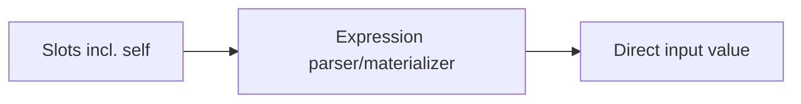
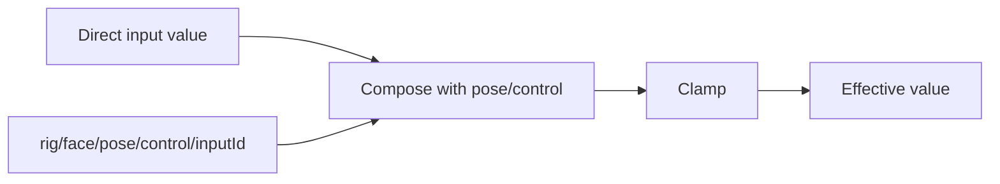
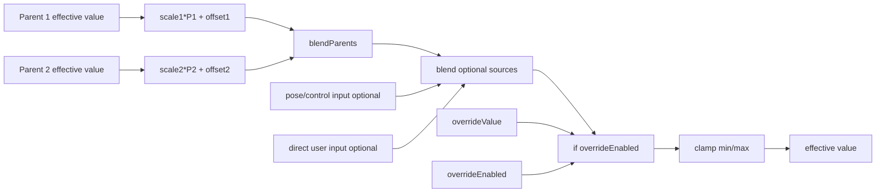
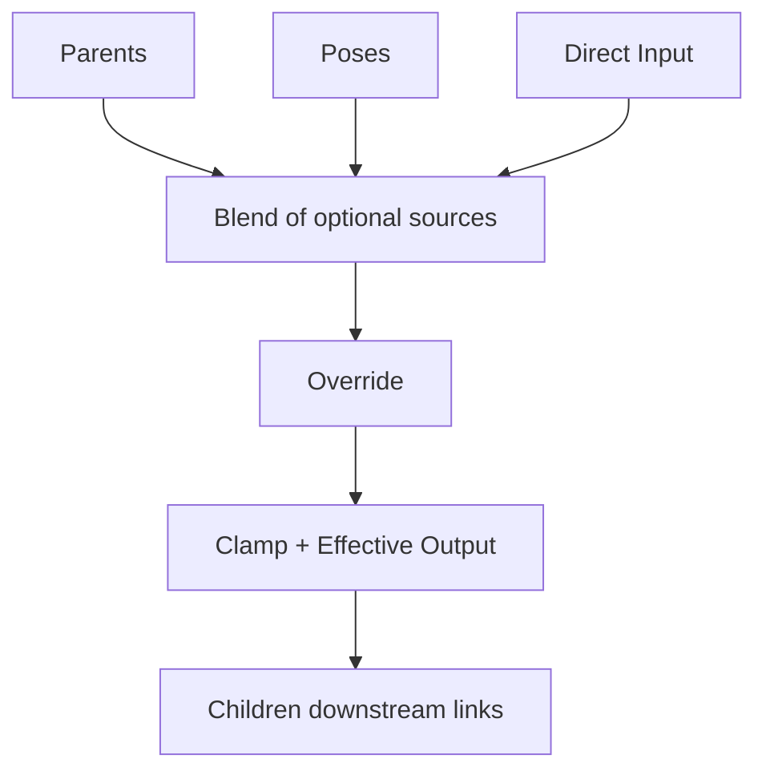
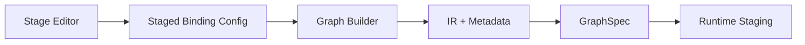

# Override Pipeline + Binding Editor Redesign Proposal (2026-02-25)

## 1) What You Want (Restated Precisely)

Target runtime equation per variable:

```text
effectiveValue = clamp(
  if(
    overrideEnabled,
    overrideValue,
    blend(parentContribution?, poseContribution?, directUserContribution?)
  )
)
```

You also want:

1. Override controls on dedicated runtime paths.
2. A clear layer model:
   1. animatable properties (lowest level),
   2. autorig channels targeting animatable sub-properties,
   3. variable-level controls and blending (parents, poses, direct input).
3. Variable-level source inputs standardized and explicit:
   1. parent inputs (linked via binding expression),
   2. pose inputs (added as pose targets in that variable channel),
   3. explicit direct user input (opt-in, not auto-enabled).
4. Override controls (`overrideEnabled`, `overrideValue`) kept separate from source blending.
5. UI/inspector and binding editor redesigned so this full pipeline is obvious, including downstream children visibility.
6. Override logic should be compiler-injected, not authored directly in each binding expression.

**References**

- User requirements in this thread
- `packages/@vizij/node-graph-authoring/src/graphBuilder.ts:1496`
- `apps/vizij-authoring/src/poseRig/graphBuilder.ts:1090`

## 2) What Exists Today (As-Is)

### 2.1 Parent bindings are expression-driven and often include `self`

Current parent-binding defaults inject `self` as the primary slot and canonical expression is alias-sum (`s1 + s2 + ...`). This is why direct control is currently represented as a slot contribution, not as a separate override stage.



**References**

- `packages/@vizij/node-graph-authoring/src/state.ts:225`
- `packages/@vizij/node-graph-authoring/src/state.ts:710`
- `apps/vizij-authoring/src/hooks/useBindingManager.ts:527`
- `apps/vizij-authoring/src/components/binding/BindingEditor.tsx:1043`

### 2.2 Pose/control is already a dedicated path

Pose graph emits `rig/<face>/pose/control/<inputId>`. Rig graph compiler then composes direct value with pose-control value and clamps.

Current compose stage uses existing modes (`add`, `average`) and normalization logic around input default baseline.



**References**

- `apps/vizij-authoring/src/poseRig/graphBuilder.ts:1090`
- `apps/vizij-authoring/src/poseRig/utils.ts:309`
- `packages/@vizij/node-graph-authoring/src/graphBuilder.ts:1483`
- `packages/@vizij/node-graph-authoring/src/graphBuilder.ts:1504`
- `packages/@vizij/node-graph-authoring/src/graphBuilder.ts:1562`

### 2.3 Export/IR metadata path exists and is extensible

Bindings and metadata are serialized in `metadata.vizij.bindings` and round-trip through IR compile/import. This gives a stable place to encode staged-pipeline metadata.

**References**

- `packages/@vizij/node-graph-authoring/src/graphBuilder.ts:1906`
- `packages/@vizij/node-graph-authoring/src/graphBuilder.ts:1936`
- `apps/vizij-authoring/src/utils/graphImport.ts:63`
- `packages/@vizij/node-graph-authoring/src/ir/compiler.ts:45`

### 2.4 Verified current blend semantics (what we have today)

Variable-level blend in rig compiler (`direct` with `pose/control`):

1. supported modes today: `add`, `average`.
2. `average`: `(direct + poseControl) / 2`.
3. `add` is default and is normalized around input default baseline:
   1. compute `direct + poseControl`,
   2. subtract baseline (`input.defaultValue`),
   3. then clamp to input range.
4. compose is applied only for inputs that opt into compose mode and are not pose-weight or pose-control channels.

Pose-graph blending:

1. intra-group/stage modes today: additive and average.
2. average path uses weighted-aggregation nodes (`weightedsumvector` + `blendweightedaverageoverlay`) against neutral/base.
3. additive path sums deltas and applies back to neutral/base.
4. cross-group policy supports additive/average, with per-channel `priority` override.

Parent-expression blending:

1. no first-class parent blend operator/mode in current binding schema.
2. parent math is currently whatever authored expression evaluates to.

Direct user input channel today:

1. direct input value path is always materialized as the input node for a variable/input.
2. there is no first-class, per-variable `directInputEnabled` gate yet.
3. this is part of what the proposal changes, so direct input becomes explicit and opt-in.

**References**

- `packages/@vizij/node-graph-authoring/src/graphBuilder.ts:1483`
- `packages/@vizij/node-graph-authoring/src/graphBuilder.ts:1534`
- `packages/@vizij/node-graph-authoring/src/graphBuilder.ts:1548`
- `packages/@vizij/node-graph-authoring/src/graphBuilder.ts:1668`
- `packages/@vizij/node-graph-authoring/src/graphBuilder.ts:1677`
- `apps/vizij-authoring/src/poseRig/graphBuilder.ts:391`
- `apps/vizij-authoring/src/poseRig/graphBuilder.ts:462`
- `apps/vizij-authoring/src/poseRig/graphBuilder.ts:568`
- `apps/vizij-authoring/src/poseRig/types.ts:10`

## 3) Proposed Runtime Pipeline (To-Be)

## 3.1 Canonical staged pipeline

For each variable/input:

1. Parent Source Branch (optional):
   1. for each linked parent `p_i`: `t_i = p_i * scale_i + offset_i`.
   2. `p_i` is the **effective value** of that upstream variable (same full pipeline), so nesting is arbitrary-depth.
   3. `parentContribution = blendParents(t_1...t_n, parentBlendMode)` when one or more parents exist.
2. Pose Source Branch (optional):
   1. `poseContribution` comes from `rig/<face>/pose/control/<inputId>` when one or more pose targets exist for this variable.
3. Direct User Source Branch (optional):
   1. `directUserContribution` exists only when user explicitly enables direct input for this variable.
4. Source Blend Stage:
   1. `blendedSources = blend(parentContribution?, poseContribution?, directUserContribution?)`.
5. Override Stage (compiler-injected):
   1. `selected = if(overrideEnabled, overrideValue, blendedSources)`.
6. Final Clamp Stage:
   1. `effectiveValue = clamp(selected, min, max)`.

This exactly matches your requested equation while keeping parent transforms explicit.

Degenerate cases:

1. Any missing source branch is excluded from `blend(...)`; missing does not imply zero.
2. If all three source branches are absent, fall back to variable baseline/default before override check.
3. Override still applies even when no source branches exist.



**References**

- `packages/@vizij/node-graph-authoring/src/graphBuilder.ts:1496`
- `packages/@vizij/node-graph-authoring/src/expressionFunctions.ts:270`
- `apps/vizij-authoring/src/poseRig/graphBuilder.ts:1090`
- `../vizij-docs/current_documentation/concepts/POSE_GRAPH_CREATION.md`
- `packages/@vizij/node-graph-authoring/src/graphBuilder.ts:1668`

## 3.2 Explicit blend semantics for the new staged pipeline

The proposal should define `blend(...)` modes explicitly and use them consistently for:

1. parent blend (`blendParents(...)`),
2. final source blend (`blend(parent?, pose?, direct?)`).

Blend modes:

1. `average`:
   1. arithmetic mean of active contributors.
2. `weighted-average`:
   1. weighted mean using authored weights.
   2. if all effective weights are zero, fall back to baseline/default.
3. `normalized-additive`:
   1. sum contributors and normalize around baseline/default so neutral contribution does not drift the channel.
   2. same intent as current add-normalization pattern used in rig compile (`sum - baseline`).

Suggested formulas:

```text
average(values) = sum(values) / N
weightedAverage(values, weights) = sum(values_i * weights_i) / sum(weights_i)
normalizedAdditive(values, baseline) = sum(values) - (N - 1) * baseline
```

For two-source blending this simplifies to:

```text
normalizedAdditive(parentResult, poseControl, baseline)
= parentResult + poseControl - baseline
```

**References**

- `packages/@vizij/node-graph-authoring/src/graphBuilder.ts:1505`
- `packages/@vizij/node-graph-authoring/src/graphBuilder.ts:1518`
- `packages/@vizij/node-graph-authoring/src/graphBuilder.ts:1548`
- `apps/vizij-authoring/src/poseRig/graphBuilder.ts:494`
- `apps/vizij-authoring/src/poseRig/types.ts:12`

## 3.3 Runtime path conventions

Keep source branches and override branches explicitly separated:

1. Parent branch:
   1. parent values come from upstream variables' effective outputs (no new dedicated path per edge).
2. Pose branch:
   1. `rig/<face>/pose/control/<inputId>` (existing dedicated pose contribution path).
3. Direct user branch:
   1. value path: `rig/<face>/<input.path>` (existing variable input path),
   2. enabled gate path: `rig/<face>/direct/<inputId>/enabled` (new explicit opt-in gate).
4. Override branch (compiler-injected):
   1. `rig/<face>/override/<inputId>/enabled`,
   2. `rig/<face>/override/<inputId>/value`.

This keeps the three blended sources distinct from override selection.

**References**

- `packages/@vizij/node-graph-authoring/src/graphBuilder.ts:1673`
- `apps/vizij-authoring/src/poseRig/utils.ts:274`
- `apps/vizij-authoring/src/poseRig/utils.ts:309`
- `apps/vizij-authoring/src/hooks/rigController/runtimeInputRoutes.ts:88`

## 3.4 Source creation and activation rules

All three source branches are optional and should be absent until user-defined:

1. Parent source branch appears when user links parent variables in binding expression / parent binding UI.
2. Pose source branch appears when user adds pose targets for this variable channel.
3. Direct user source branch appears only when user enables direct input for this variable.

Override is separate:

1. override controls do not define source membership;
2. override only chooses between `blendedSources` and `overrideValue` at compile-injected selection stage.
3. children are downstream dependents and are not part of this variable's source blend inputs.

**References**

- `apps/vizij-authoring/src/hooks/useBindingManager.ts:561`
- `apps/vizij-authoring/src/components/inspector/InspectorContent.tsx:2078`
- `apps/vizij-authoring/src/poseRig/usePoseRigAuthoring.ts:320`

## 4) Make The Expression Explicit (Authoring Model)

## 4.1 New explicit expression surface

Replace implicit "slot math + hidden compose semantics" with two explicit views:

1. Authored parent expression (editable):
   1. only describes parent-source math and per-parent transforms.
2. Compiled effective equation (read-only):
   1. shows parent, pose, direct-input blend plus compiler-injected override and clamp stages.

Suggested inspector display:

```text
Parent expression (editable):
parentContribution = blendParents([
  parentA * scaleA + offsetA,
  parentB * scaleB + offsetB,
  ...
], parentBlendMode)
```

```text
Compiled effective equation (read-only):
effective = clamp(
  if(override.enabled,
     override.value,
     blend(
       parentContribution?,
       poseContribution?,
       directUserContribution?
     )
  )
)
```

Alternate expanded read-only form:

```text
effective = clamp(
  if(override.enabled,
     override.value,
     blend(
       blendParents([
         parentA * scaleA + offsetA,
         parentB * scaleB + offsetB,
         ...
       ], parentBlendMode),
       poseContribution?,
       directUserContribution?,
       sourceBlendMode
     )
  )
)
```

Two modes:

1. Guided mode (default): stage controls, with parent expression area plus read-only compiled equation.
2. Expert mode (optional): allow editing `blendParents(...)` term only, with validation; pose/direct/override/clamp remain compiler-managed.

This keeps behavior clear and avoids conflating authored sources with compiler-injected override mechanics.

**References**

- `apps/vizij-authoring/src/components/binding/BindingEditor.tsx:818`
- `packages/@vizij/node-graph-authoring/src/graphBuilder.ts:349`
- `packages/@vizij/node-graph-authoring/src/graphBuilder.ts:1534`
- `../vizij-docs/current_documentation/concepts/BINDING_EXPRESSIONS.md`

## 4.2 Data model changes

Introduce a staged config for each derived input binding, instead of relying on `self` slot semantics:

```ts
interface ParentStageEntry {
  linkId: string; // canonical parent->child link id
  inputId: string;
  alias: string;
  scale: number; // default 1
  offset: number; // default 0
  enabled: boolean;
}

interface StagedBindingConfig {
  inputId: string;
  parents: ParentStageEntry[];
  // Reverse dependency view: children reading this variable as parent.
  // scale/offset shown here are the SAME link params from the child's parent entry (by linkId), not a duplicate set.
  children: Array<{
    linkId: string;
    childInputId: string;
  }>;
  parentBlend: {
    mode: "average" | "weighted-average" | "normalized-additive";
    weights?: Record<string, number>;
  };
  poseSource: {
    // Derived from pose targets affecting this variable channel.
    // Empty means no pose branch for this variable.
    targetIds: string[];
  };
  directInput: {
    enabled: boolean; // user-controlled, default false
    valuePath: string;
    enabledPath: string;
  };
  sourceBlend: {
    mode: "average" | "weighted-average" | "normalized-additive";
    weightParent?: number;
    weightPose?: number;
    weightDirect?: number;
  };
  sourceFallback: {
    whenNoSources: "use-baseline";
  };
  override: {
    enabledDefault: boolean;
    valueDefault: number;
    enabledPath?: string;
    valuePath?: string;
  };
}
```

Store this under binding metadata and generate compile graph deterministically from it.
The key ownership rule is link-centric: `scale` and `offset` belong to the parent->child link and are edited through one canonical record (`linkId`), regardless of whether user edits from parent view or child view.

**References**

- `packages/@vizij/utils/src/rig/standard-inputs.ts:37`
- `packages/@vizij/utils/src/rig/standard-inputs.ts:111`
- `packages/@vizij/node-graph-authoring/src/graphBuilder.ts:444`
- `packages/@vizij/node-graph-authoring/src/graphBuilder.ts:1936`
- `apps/vizij-authoring/src/poseRig/types.ts:12`
- `apps/vizij-authoring/src/hooks/useManagedStandardInputs.ts:37`

## 5) Binding Editor / Inspector Redesign

## 5.1 Proposed inspector layout

Variable inspector should show five primary groups:

1. Parents:
   1. list of linked parents,
   2. per-parent scale/offset,
   3. per-parent value slider for inspection/control.
2. Children:
   1. list of downstream child variables that depend on this variable,
   2. per-child scale/offset controls bound to the SAME parent->child link parameters (`linkId`) used in the child's parent row (no duplicate parameter set).
3. Poses:
   1. list of pose targets affecting this variable channel,
   2. weight sliders per pose target.
4. Direct Input:
   1. explicit enable toggle (off by default),
   2. direct-input slider/number when enabled.
5. Override:
   1. override enable toggle,
   2. override value slider/number,
   3. runtime-path badges.

Output preview (blend result, selected result, clamped effective value) should be shown as read-only diagnostics, not a fifth editable source group.



This makes causality visible and debuggable for each variable.

**References**

- `apps/vizij-authoring/src/components/binding/BindingEditor.tsx:977`
- `apps/vizij-authoring/src/components/inspector/FeatureList.tsx:625`
- `apps/vizij-authoring/src/components/inspector/InspectorContent.tsx:2179`
- `apps/vizij-authoring/src/hooks/useManagedStandardInputs.ts:37`

## 5.2 What to retire or de-emphasize

1. `Slider (self)` as primary UX concept.
2. Hidden pose contributions not visible in variable inspector.
3. Hidden compose behavior not represented in editor.
4. One-layer slot expression UI for non-trivial authored variables.

Keep legacy rendering for migrated assets in a "legacy binding" section until fully converted.

**References**

- `apps/vizij-authoring/src/components/binding/BindingEditor.tsx:1043`
- `packages/@vizij/node-graph-authoring/src/state.ts:225`
- `packages/@vizij/node-graph-authoring/src/__tests__/irSnapshots.test.ts:248`

## 6) What Must Change In Code

1. Compiler (`graphBuilder`):
   1. add explicit nodes for parent transform, parent blend, pose source, direct-input source, source blend, override if, clamp;
   2. compiler injects override wrapper automatically (not authored in per-input binding expression);
   3. feed final selected value into existing output pipeline.
2. Binding schema/types:
   1. add staged binding config + metadata serialization.
   2. make parent/child scale+offset link-owned (single canonical link record).
3. UI/editor:
   1. replace slot-first editor with stage editor; keep legacy adapter.
   2. add children pane that edits the same link params as parent rows (no duplicate controls).
4. Runtime route mapping:
   1. register direct-input enabled path and override runtime paths for staging and inspector control.
5. Import/export:
   1. round-trip staged metadata in `vizij` envelope; dual-read legacy bindings.



**References**

- `packages/@vizij/node-graph-authoring/src/graphBuilder.ts:1437`
- `apps/vizij-authoring/src/hooks/useRigController.ts:1323`
- `apps/vizij-authoring/src/hooks/rigController/runtimeInputRoutes.ts:42`
- `apps/vizij-authoring/src/utils/graphImport.ts:63`

## 7) Migration Strategy

## 7.1 Legacy mapping rules

1. Canonical legacy case (`self + parents` style):
   1. map `self` behavior to override stage default-disabled,
   2. map non-self slots into parent rows with scale=1/offset=0.
2. Complex legacy expressions using `self` in custom math:
   1. keep in legacy mode,
   2. flag with migration warning,
   3. provide manual conversion tool.
3. Legacy always-on direct input behavior:
   1. migrate to explicit `directInput.enabled = true` to preserve behavior,
   2. allow opt-out per variable after migration.

## 7.2 Phased rollout

1. Phase 1: dual-read compiler + metadata schema.
2. Phase 2: new stage editor behind feature flag.
3. Phase 3: migration assistant and warnings.
4. Phase 4: default new assets to staged model; legacy read still supported.

**References**

- `packages/@vizij/node-graph-authoring/src/__tests__/graphBuilder.test.ts:1321`
- `packages/@vizij/node-graph-authoring/src/__tests__/irParity.test.ts:297`
- `packages/@vizij/node-graph-authoring/src/__tests__/irSnapshots.test.ts:286`

## 8) Risks and Decisions Needed

1. Override semantics relative to pose:
   1. this proposal follows your requested formula: override bypasses pose-blended branch.
2. Blend function policy:
   1. define exact default modes for `parentBlend` and `sourceBlend` (`average`, `weighted-average`, `normalized-additive`) and baseline fallback behavior.
3. Editor complexity:
   1. stage UI is clearer but larger; needs careful progressive disclosure.
4. Runtime cost:
   1. added nodes per variable; may need lazy materialization optimization.

**References**

- `packages/@vizij/node-graph-authoring/src/graphBuilder.ts:1534`
- `packages/@vizij/node-graph-authoring/src/graphBuilder.ts:1562`
- `../vizij-docs/current_documentation/concepts/deeper_exploration/GRAPH_CONVENTIONS.md`

## 9) Recommended Next Steps

1. Approve exact semantics for:
   1. `blendParents` default mode (`average`, `weighted-average`, `normalized-additive`),
   2. multi-source blend default mode for `parent + pose + direct` (`average`, `weighted-average`, `normalized-additive`),
   3. no-source fallback baseline behavior,
   4. direct-input default policy (`enabled=false`),
   5. override-enabled default and whether per-variable default is persisted.
2. Approve staged binding schema and metadata contract.
3. Confirm expression scope policy:
   1. binding expression authors parent branch only,
   2. compiler injects pose/direct/override/clamp wrappers.
4. Confirm link-ownership policy:
   1. parent/child scale+offset are one shared parameter set per link,
   2. parent pane and children pane both edit the same link record.
5. Implement compiler dual-read first, then UI stage editor.
6. Add migration and regression tests before flipping defaults.

**References**

- `apps/vizij-authoring/src/hooks/__tests__/rigGraphCompiler.test.ts:35`
- `packages/@vizij/node-graph-authoring/src/graphBuilder.ts:1906`
- `apps/vizij-authoring/src/components/binding/BindingEditor.tsx:361`
