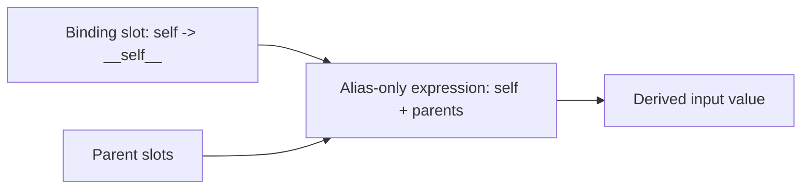
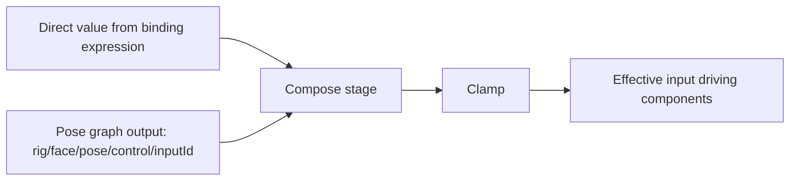
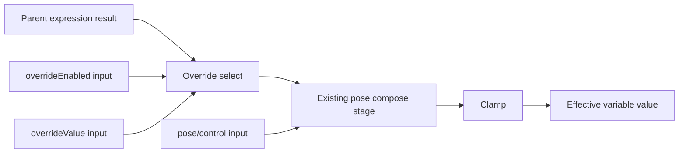

# Self Slider -> Override Slider Investigation Report (2026-02-25)

## Scope

This report evaluates replacing the current `self` slider model with an explicit override model:

1. Every controllable variable has an override value and override-enabled flag.
2. Binding resolution becomes conditional: if override is enabled, use override value; else use bound-parent expression.
3. Pose outputs remain a dedicated contribution path and are not routed through the override decision branch.

This analysis was run with parallel sub-agents across UI/state, graph compiler/IR/export, pose graph pipeline, and canonical docs in `vizij-docs`.

### References

- `apps/vizij-authoring/src/components/binding/BindingEditor.tsx`
- `packages/@vizij/node-graph-authoring/src/graphBuilder.ts`
- `apps/vizij-authoring/src/poseRig/graphBuilder.ts`
- `../vizij-docs/current_documentation/concepts/BINDING_EXPRESSIONS.md`

## Executive Summary

The idea is feasible without breaking architecture, but it should be implemented as a compiler-level feature with a compatibility bridge for existing `self` expressions.

Recommended direction:

1. Keep binding expressions parent-focused.
2. Compile per-input override controls as a separate branch (`overrideEnabled`, `overrideValue`) around the derived-input expression result.
3. Keep pose contribution composition outside that branch, so pose control remains a dedicated signal path.
4. Migrate legacy `self` usage with a dual-read strategy first, then optional cleanup.

Main risk is compatibility with existing graphs that use `self` in non-canonical expressions. Those must be detected and either converted safely or left in legacy mode with warnings.

### References

- `packages/@vizij/node-graph-authoring/src/state.ts:225`
- `packages/@vizij/node-graph-authoring/src/graphBuilder.ts:1576`
- `packages/@vizij/node-graph-authoring/src/graphBuilder.ts:1483`
- `packages/@vizij/node-graph-authoring/src/__tests__/irParity.test.ts:297`

## Current Architecture (As-Is)

### 1) Binding authoring model and why `self` is additive today

Current parent-binding defaults are additive by construction:

1. Parent bindings are initialized with primary slot alias `self` and `inputId = SELF_BINDING_ID`.
2. Canonical expressions are auto-generated as alias-only sums (`slot1 + slot2 + ...`).
3. As more slots are added, `self` naturally stays in the expression unless explicitly removed.

That is why direct local control is currently modeled as a regular slot contribution instead of a separate override mode.



#### References

- `packages/@vizij/node-graph-authoring/src/state.ts:225`
- `packages/@vizij/node-graph-authoring/src/state.ts:710`
- `apps/vizij-authoring/src/hooks/useBindingManager.ts:527`
- `packages/@vizij/utils/src/rig/standard-inputs.ts:78`

### 2) How `self` compiles into runtime graph nodes

Compiler behavior today:

1. If a binding or any slot references `SELF_BINDING_ID`, graphBuilder emits a raw input node `input_raw_<inputId>`.
2. `self` is registered as a reserved variable and bound to that node for expression materialization.
3. The expression parser/materializer builds the final value node from slot + reserved references.

This is implemented in `evaluateBinding(...)` plus `ensureInputNode(...)`.

#### References

- `packages/@vizij/node-graph-authoring/src/graphBuilder.ts:158`
- `packages/@vizij/node-graph-authoring/src/graphBuilder.ts:214`
- `packages/@vizij/node-graph-authoring/src/graphBuilder.ts:325`
- `packages/@vizij/node-graph-authoring/src/graphBuilder.ts:1603`
- `packages/@vizij/node-graph-authoring/src/expressionVocabulary.ts:17`

### 3) IR/export metadata and round-trip pipeline

Binding summaries (including expression and metadata) are carried in `summary.bindings` and injected into GraphSpec metadata under `metadata.vizij.bindings`.

`prepareSpecForImport(...)` recompiles from IR when available, while preserving the `vizij` metadata envelope.

So override semantics must be represented in a way that round-trips through:

1. authoring state,
2. graphBuilder summaries,
3. IR compile,
4. metadata export/import.

#### References

- `packages/@vizij/node-graph-authoring/src/graphBuilder.ts:444`
- `packages/@vizij/node-graph-authoring/src/graphBuilder.ts:1906`
- `packages/@vizij/node-graph-authoring/src/ir/compiler.ts:18`
- `apps/vizij-authoring/src/utils/graphImport.ts:63`
- `packages/@vizij/utils/src/rig/standard-inputs.ts:37`

### 4) Runtime staging and input route assumptions

Runtime input updates are ID-based in authoring (`handleInputValueChange`), then resolved to graph paths via `buildRuntimeInputRouteSnapshot`.

Important detail: route snapshot intentionally skips pose-control paths, keeping them internal and out of user-facing standard-input controls.

#### References

- `apps/vizij-authoring/src/hooks/useRigController.ts:1608`
- `apps/vizij-authoring/src/hooks/useRigController.ts:1641`
- `apps/vizij-authoring/src/hooks/rigController/runtimeInputRoutes.ts:42`
- `apps/vizij-authoring/src/hooks/rigController/runtimeInputRoutes.ts:88`

### 5) Pose graph path is already dedicated and separately composed

Pose graph builder emits outputs to `rig/<face>/pose/control/<inputId>`.

Rig graph compilation then composes pose-control input with direct input value in a dedicated stage (`buildEffectiveInputNodeId`), excluding pose-control and pose-weight inputs from recursive compose logic.

This already gives a clean seam where override logic can live upstream of pose composition.



#### References

- `apps/vizij-authoring/src/poseRig/graphBuilder.ts:1090`
- `apps/vizij-authoring/src/poseRig/utils.ts:274`
- `packages/@vizij/node-graph-authoring/src/graphBuilder.ts:1483`
- `packages/@vizij/node-graph-authoring/src/graphBuilder.ts:1504`

## Proposed Architecture (To-Be)

### Behavior contract

For each derived variable/input:

1. `overrideEnabled` (boolean-like scalar, default `0` / false)
2. `overrideValue` (scalar, default = input default)
3. `baseValue` = parent binding expression result
4. `selectedValue` = `if(overrideEnabled, overrideValue, baseValue)`
5. `effectiveValue` = compose `selectedValue` with pose-control contribution (existing compose stage)

This preserves dedicated pose path semantics while enabling deterministic manual override.

### Suggested compile layering



### Suggested path conventions

Use internal runtime paths for override controls (not standard-input namespace):

1. `rig/<face>/override/<inputId>/enabled`
2. `rig/<face>/override/<inputId>/value`

Rationale:

1. avoids polluting `/standard/...` conventions,
2. keeps overrides clearly authoring/runtime-control scoped,
3. allows UI to expose override controls contextually in inspector instead of globally.

#### References

- `packages/@vizij/node-graph-authoring/src/graphBuilder.ts:1576`
- `packages/@vizij/node-graph-authoring/src/graphBuilder.ts:1496`
- `apps/vizij-authoring/src/hooks/rigController/runtimeInputRoutes.ts:66`
- `../vizij-docs/current_documentation/concepts/deeper_exploration/STANDARD_INPUTS.md`

## Implementation Strategies

### Option A (Recommended): Compiler-injected override branch

Keep expression authoring mostly unchanged for parent slots; inject override select logic in `graphBuilder` around derived-input evaluation.

Pros:

1. minimal UI disruption,
2. no broad expression rewriting,
3. keeps override semantics deterministic at compile output,
4. cleanly coexists with current pose compose stage.

Cons:

1. adds compile complexity for derived inputs,
2. needs route/UI plumbing for synthetic override controls.

### Option B: Expression rewrite in state layer

Rewrite expression text to include override condition (e.g. auto-wrap with `if(...)`).

Pros:

1. conceptually explicit in text form.

Cons:

1. fragile with user-edited expressions,
2. higher migration risk,
3. harder to guarantee safe round-trip and diagnostics.

### Option C: Runtime-only override in controller (outside graph)

Apply override after graph output in controller state rather than in graph compile.

Pros:

1. low compiler churn.

Cons:

1. breaks runtime-truthful architecture,
2. risks export/runtime mismatch,
3. likely to diverge from IR/GraphSpec behavior.

Recommendation: Option A.

#### References

- `packages/@vizij/node-graph-authoring/src/graphBuilder.ts:1437`
- `packages/@vizij/node-graph-authoring/src/ir/compiler.ts:18`
- `apps/vizij-authoring/src/hooks/useRigController.ts:1323`
- `../vizij-docs/current_documentation/concepts/IR_GRAPH.md`

## Detailed Change Blueprint (Option A)

### 1) Schema + metadata

Add override metadata under binding metadata (or equivalent summary payload) so import/export can preserve intent.

Candidate shape:

```ts
interface RigBindingOverrideMetadata {
  mode: "replace-parent-branch";
  enabledPath: string;
  valuePath: string;
  defaultEnabled: boolean;
}
```

Where to extend:

1. `RigBindingMetadata` type (`@vizij/utils`)
2. `GraphBindingSummary.metadata` emission
3. `vizijMetadata.bindings` serialization path

#### References

- `packages/@vizij/utils/src/rig/standard-inputs.ts:37`
- `packages/@vizij/node-graph-authoring/src/graphBuilder.ts:444`
- `packages/@vizij/node-graph-authoring/src/graphBuilder.ts:1936`

### 2) Graph builder

In derived-input compile path (`ensureInputNode`):

1. compute current parent-expression node as today,
2. create override inputs (`enabled`, `value`),
3. create selection node (`if`/equivalent) choosing override vs parent expression,
4. pass selected node into existing `buildEffectiveInputNodeId` so pose composition remains independent.

Do not route pose-control through this branch.

#### References

- `packages/@vizij/node-graph-authoring/src/graphBuilder.ts:1576`
- `packages/@vizij/node-graph-authoring/src/graphBuilder.ts:1603`
- `packages/@vizij/node-graph-authoring/src/graphBuilder.ts:1496`
- `packages/@vizij/node-graph-authoring/src/expressionFunctions.ts:270`

### 3) Authoring state + UI

Replace "self as slot" UX with explicit override controls in inspector:

1. toggle: `Override` on/off,
2. slider/number: override value,
3. expression slot list: parent sources only.

Keep legacy `self` view/read support temporarily for imported data.

#### References

- `apps/vizij-authoring/src/components/binding/BindingEditor.tsx:1043`
- `apps/vizij-authoring/src/hooks/useBindingManager.ts:527`
- `packages/@vizij/node-graph-authoring/src/state.ts:225`

### 4) Runtime routing

Either:

1. add synthetic override control IDs mapped to override paths, or
2. add direct graph-path staging for inspector override controls.

Do not expose pose-control paths as regular user sliders.

#### References

- `apps/vizij-authoring/src/hooks/useRigController.ts:1608`
- `apps/vizij-authoring/src/hooks/rigController/runtimeInputRoutes.ts:88`

### 5) Import/export compatibility

Import should support:

1. new override metadata,
2. existing self-slot graphs.

Export should continue embedding IR + GraphSpec + metadata consistently in `vizij` envelope.

#### References

- `apps/vizij-authoring/src/utils/graphImport.ts:63`
- `packages/@vizij/node-graph-authoring/src/ir/compiler.ts:45`
- `packages/@vizij/node-graph-authoring/src/graphBuilder.ts:1906`

## Migration Plan (Safe Rollout)

### Phase 1: Dual-read, legacy-write compatible

1. Compile supports override branch when metadata exists.
2. Legacy `self` behavior continues unchanged when override metadata absent.
3. Add warnings for non-canonical `self` expressions that cannot be auto-converted safely.

### Phase 2: UI enablement

1. Introduce override toggle/value controls in binding inspector.
2. New authoring defaults to override model.
3. Existing assets still load with legacy mode if needed.

### Phase 3: Migration tooling

1. Add one-click migration: remove canonical `self` slot usage and create override metadata.
2. Leave complex `self` expressions untouched, flagged for manual review.

### Phase 4: Optional cleanup

1. deprecate `SELF_BINDING_ID` for new content,
2. keep read compatibility for historical bundles.

#### References

- `packages/@vizij/node-graph-authoring/src/__tests__/graphBuilder.test.ts:1321`
- `packages/@vizij/node-graph-authoring/src/__tests__/irSnapshots.test.ts:248`
- `packages/@vizij/node-graph-authoring/src/__tests__/irParity.test.ts:297`
- `../vizij-docs/current_documentation/concepts/BINDING_EXPRESSIONS.md`

## Validation and Performance Plan

### Correctness tests to add

1. Compiler tests: override false follows parent expression exactly.
2. Compiler tests: override true follows override value.
3. Compiler tests: pose composition still applies outside override branch.
4. Import/export round-trip tests: metadata + IR + GraphSpec preserve override semantics.
5. UI tests: override toggle/value updates runtime paths correctly.

### Performance checks

1. measure node count delta per derived input,
2. compare frame time when many derived inputs exist,
3. verify no extra route churn or large re-renders in inspector.

Important note: always materializing override nodes for every derived input can increase runtime graph cost. If needed, use lazy node materialization while preserving logical defaults in metadata.

#### References

- `apps/vizij-authoring/src/hooks/__tests__/rigGraphCompiler.test.ts:35`
- `packages/@vizij/node-graph-authoring/src/__tests__/graphBuilder.test.ts:1335`
- `apps/vizij-authoring/src/hooks/useRigController.ts:1323`
- `apps/vizij-authoring/src/hooks/rigController/runtimeInputRoutes.ts:42`

## Open Decisions Before Implementation

1. Override semantics with pose active:
   - keep pose compose active even when override is enabled (recommended for dedicated pose path), or bypass pose too?
2. Override control visibility:
   - per-variable inspector only (recommended), or include in global input tree?
3. Migration policy for complex `self` expressions:
   - strict manual review vs best-effort transform with warnings.
4. Physical node strategy:
   - always compile override nodes vs lazy compile.

### References

- `packages/@vizij/node-graph-authoring/src/graphBuilder.ts:1483`
- `apps/vizij-authoring/src/poseRig/graphBuilder.ts:1090`
- `packages/@vizij/node-graph-authoring/src/state.ts:710`
- `../vizij-docs/current_documentation/concepts/POSE_GRAPH_CREATION.md`
