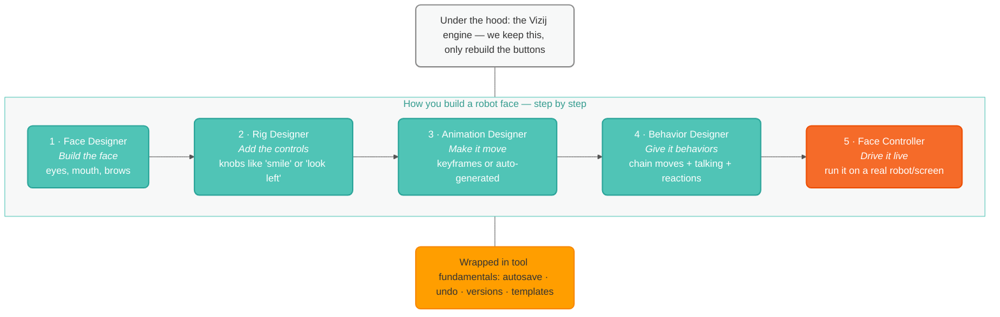

# Vizij Authoring Rebuild — The Simple Version (Start Here)

> A plain-language overview of what we're doing and where things stand. For the detail,
> see docs `01`–`06` (mapped at the bottom).

## What is Vizij?

Vizij is a toolkit for giving **robots expressive faces** — eyes that look around, brows
that raise, a mouth that talks and smiles. It's meant to be open and shared, so different
robots and researchers can reuse each other's faces, controls, and animations instead of
everyone rebuilding from scratch.

## What are we doing?

We're **rebuilding the app you use to make those faces** so it's much simpler and easier to
use. We are **not** rebuilding the powerful machinery underneath (the "engine") — that part
works. We're redesigning the *buttons, screens, and flow* on top of it.

Think of it like a kitchen: the appliances (engine) are great, but the kitchen layout is
cluttered and confusing. We're redesigning the layout, not replacing the oven.

## The big idea: build a face in layers

Making an expressive face happens in steps, like an assembly line. Each step builds on the
one before it, and each is its own "studio" — but they're all part of **one integrated
tool working on the same face**, not five separate apps. You glide between studios while
the same live face stays in front of you:

**The five studios, in plain words:**

1. **Face Designer** — build what the face *looks like* from reusable parts (eyes, brows,
   mouth). Like a character creator.
2. **Rig Designer** — add the *controls*: simple knobs like "smile," "look left," or
   "surprise," so you don't have to move every tiny piece by hand. (Some controls are
   specific to one face; others are shared "standards" that work across many faces.)
3. **Animation Designer** — make the face *move over time*, either by setting poses at
   moments (keyframes) or by letting the computer generate motion (procedural).
4. **Behavior Designer** — string moves together into *behaviors*, add speech and
   lip-sync, and let it *react* (e.g. look at a person). This is the "personality" layer.
5. **Face Controller** — *drive the finished face live* on a real robot or screen
   (even several at once), and the place a programmer tests controlling it from code.

## Who uses it?

Six **roles** (jobs). One real person (a **persona**) often does several at once:

- A **solo researcher** might do almost all of it themselves.
- A **studio team** might split the jobs — one person designs the face, another rigs it,
  another animates, another designs the experience.

We design for the *jobs*, and make sure one person can move between studios smoothly.

## What we've decided so far

- **Keep the engine; rebuild the interface.** The hard machinery stays.
- **Five studios, built in order** (face → rig → animate → behavior → drive), then a
  cleanup pass to make them feel consistent.
- **One simple default path, with "advanced" tucked away.** Beginners get a clean path;
  power users can open up more — so it serves both designers and researchers.
- **The engine is the foundation, not the design.** Today's under-the-hood pieces (how
  blending and inputs work) are *reusable plumbing*, **not** a rule for what the screens
  must look like. We can design simpler interfaces on top.
- **Get the basics right early** — saving, undo, templates, and a clear **versioning**
  system (since we're still pre-1.0) — instead of bolting them on later.

## Where we are right now

We're in **planning** — no rebuilding yet. So far we've written down, with the team:

- the overall idea and rules,
- a list of every existing feature and whether to keep / simplify / cut it,
- who the users are and what each needs from each studio,
- the gaps the original design paper missed (like behaviors and reacting to sensors),
- and deep-dives on the two trickiest areas (controls/inputs and the basics/versioning).

**Next up:** sketching what the actual screens look like (information architecture +
low-fi sketches), then designing them in Figma.

## The document map

| Doc | What it is |
| --- | --- |
| `00` (this) | The simple, high-level overview |
| `01-conceptual-model.md` | The core idea, the layers, the rules |
| `02-feature-audit.md` | Every current feature → keep / simplify / cut |
| `03-roles-and-interface-plans.md` | Who uses it + what each studio gives them |
| `04-beyond-the-paper.md` | Gaps the original paper missed + what to do |
| `05-inputs-model-and-variations.md` | Deep-dive: the controls/inputs, with options |
| `06-tool-fundamentals-and-versioning.md` | Deep-dive: the basics + versioning |
