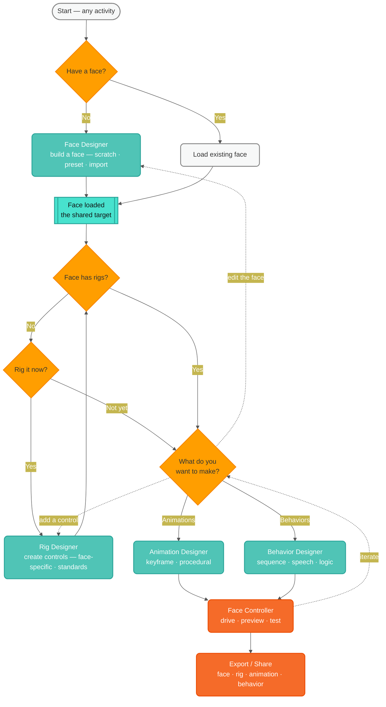

# Authoring Rebuild — Workflow Decision Tree (IA · iteration 1)

> The first of **many** information-architecture iterations — no mockups yet. This maps the
> *logic of the user's workflow*: what must be true before each activity is available, and
> how the activities (`01` §3) gate and flow into each other over the **one shared target**
> (`01` §4.3, `07`). Editable Semio-themed mermaid; renders inline on GitHub.

## The core gating logic

1. **Every activity needs a face first.** The first decision is always: *do you have a
   face, or do you create one?* Nothing else is reachable until a face is the loaded target.
2. **Rigging is gated on a face; animating/behaving is gated on rigs.** Once a face is
   loaded, if it has **no rigs**, the natural next step is the Rig Designer. If it **has
   rigs** (or you choose to move on), you can design **animations** or **behaviors**.
3. **It's a loop, not a line.** Because it's one integrated target, you can return to edit
   the face or add a control at any time — the tree shows the *primary* path plus the most
   common loop-backs (dashed).

## The decision tree

**Legend:** amber = decision · teal = an authoring activity · bright teal = the shared
target · orange = run/output. Dashed arrows = common non-linear loop-backs.

## Walkthrough

- **Start → Have a face?** The universal entry gate.
  - **No →** Face Designer to build one (from scratch, a preset, or a Blender/glTF import).
  - **Yes →** Load the existing face.
- **Face loaded (shared target).** Everything downstream operates on this one live face.
- **Face has rigs?**
  - **No → Rig it now?** → **Yes:** Rig Designer to create controls (face-specific, and/or
    align to standards). **Not yet:** continue, but note animating/behaving without controls
    is limited (you can only drive low-level properties directly).
  - **Yes →** proceed to make something.
- **What do you want to make?** → **Animations** (keyframe/procedural) or **Behaviors**
  (sequences + speech + logic).
- **Face Controller** drives/previews/tests the result; **Export/Share** emits the
  artifacts.
- **Loop-backs (dashed):** from "what to make," jump back to edit the face or add a control;
  from driving, iterate on what you're making.

## Open questions for the next IA iterations

These are deliberately unresolved — this is iteration 1:

1. **Skip-rigging path.** What exactly can you do with a face that has *no* rigs? Is direct
   low-level posing a real entry, or do we always nudge toward rigging first?
2. **Standards vs. face-specific rigs.** The "Rig it now?" branch hides a sub-decision
   (face-specific rig vs. align-to-standard vs. import a rig). Needs its own sub-tree.
3. **Entry by intent.** A returning user often opens the tool *to do a specific thing*
   ("animate Toasty"). Should the tree also support entering at an activity and back-filling
   prerequisites (e.g. "you need a rig first — make one?")?
4. **Where do faces come from?** "Load existing" hides: local library, shared/community
   library, recent, or a bundle import — connects to the artifact/versioning model (`06`).
5. **Multi-artifact projects.** One face may have many rigs/animations/behaviors. The tree
   shows single-artifact flow; managing *collections* per face is a separate IA piece.
6. **Drive/preview is always-available.** In the integrated shell you can preview anytime,
   not only at the end — how does that reconcile with the linear-looking tree?

## What this feeds

- The **activity path** in the layered shell (`07`): which activities are enabled/gated,
  and the prompts shown when a prerequisite is missing.
- Subsequent IA iterations: per-activity sub-trees (esp. Rig Designer and "load a face"),
  entry-by-intent flows, and the project/collection model — *before* any mockups.
