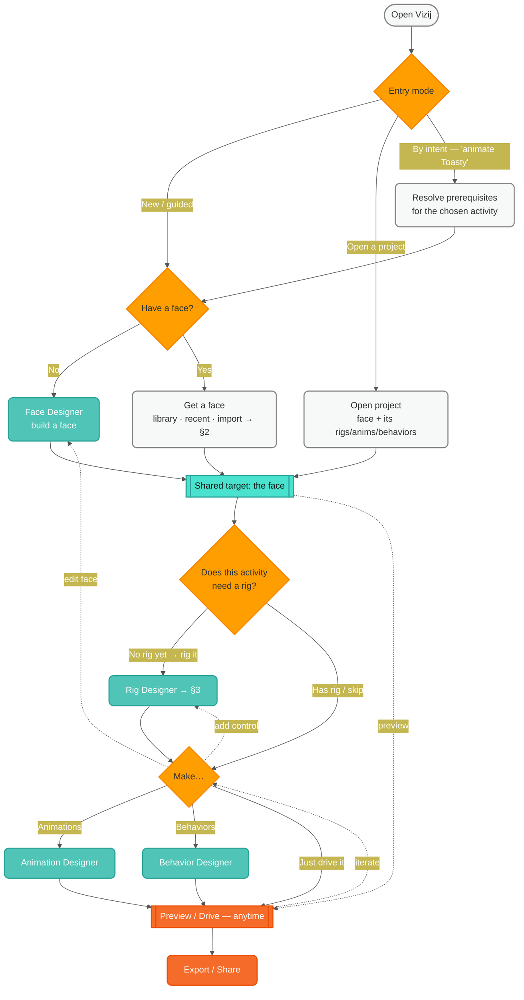
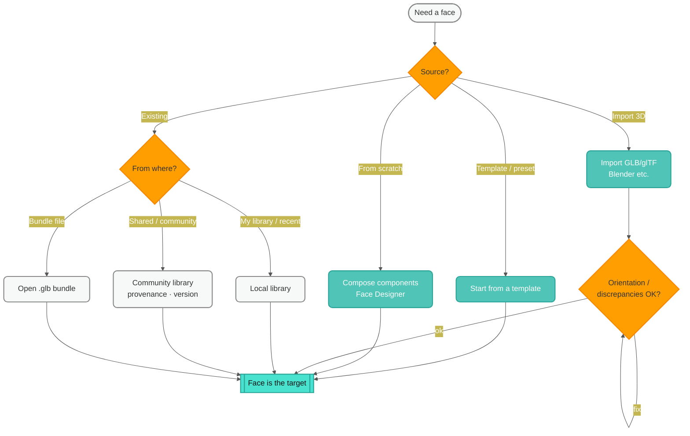
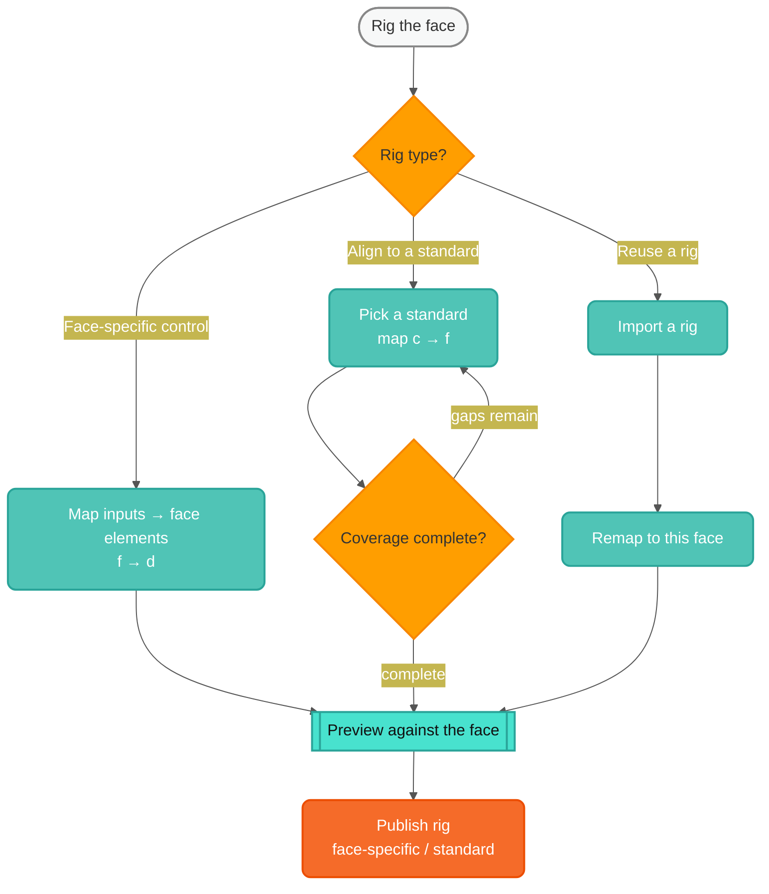
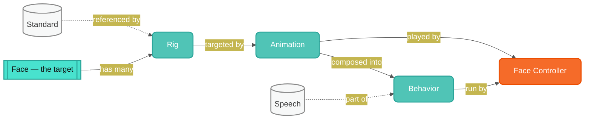
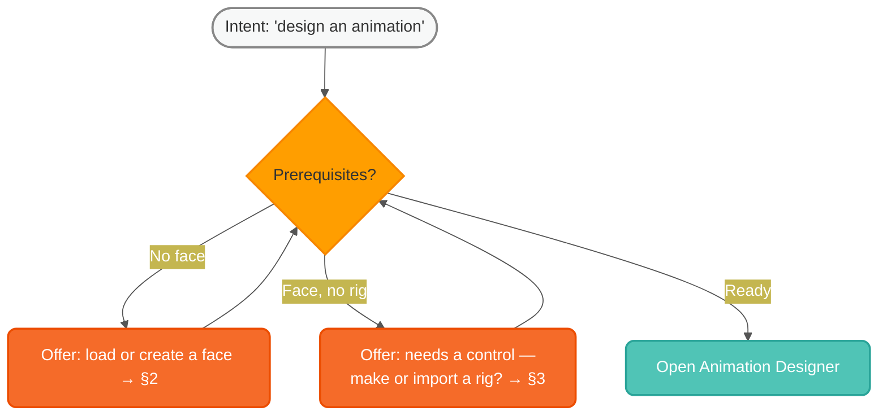

# Authoring Rebuild — IA Workflow, Expanded (IA · iteration 2)

> Builds on `08-workflow-decision-tree.md` (the core gating view). Still no mockups — this
> refines the *logic*. It resolves several of iteration 1's open questions into structure:
> **entry-by-intent**, the **"get a face"** and **"rig it"** sub-trees, the **project /
> artifact model**, and a **state → enabled-activities** matrix. All diagrams are editable
> Semio-themed mermaid and render inline on GitHub.

## 1. Refined top-level flow (two ways in + prerequisite back-fill)

Iteration 1 assumed a single linear start. In reality there are **two entry modes** that
converge on the same shared target, and a returning user often enters **by intent** (they
open the tool *to do a thing*), so missing prerequisites get **back-filled** rather than
blocking. Preview/Drive is reachable **anytime**, not just at the end.

## 2. Sub-tree — getting a face

"Load a face" hides several sources, plus the import-correctness step.

## 3. Sub-tree — rig it

The "rig it now?" branch hides a real sub-decision: build a face-specific control, align to
a community standard, or reuse an existing rig.

## 4. Project & artifact model (what contains what)

A **project centers on one face** (multi-face is a later question, §7). The face has many
rigs; animations target a rig; behaviors compose animations + speech/logic; standards are
referenced by rigs. This is *why* the gating exists — each artifact depends on the one below.

## 5. Entry-by-intent — prerequisite back-fill

When a user enters *to do a specific thing*, don't dead-end them. Check prerequisites and
offer to create what's missing, then drop them into the activity.

## 6. State → enabled activities

Availability is a function of project state. This is the precise, implementable form of the
gating logic (drives which activities the shell's path enables, and the back-fill prompts).

| Project state | Face Designer | Rig Designer | Animation Designer | Behavior Designer | Controller (drive) |
| --- | --- | --- | --- | --- | --- |
| Empty | create a face | — | — | — | — |
| Face, no rig | ✓ edit | ✓ create | limited¹ | limited¹ | ✓ preview face |
| Face + rig | ✓ | ✓ | ✓ | needs animations² | ✓ |
| Face + rig + animation | ✓ | ✓ | ✓ | ✓ | ✓ |
| + behaviors | ✓ | ✓ | ✓ | ✓ | ✓ drive behaviors |

¹ *Without a rig you can only drive low-level properties directly (`d`) — possible but
tedious; the tool nudges toward rigging.*
² *A behavior sequences animations, so it wants at least one animation (or a live/standard
input) to be meaningful.*

## 7. Resolved vs. still-open

**Resolved from iteration 1 (`08`):**
- Skip-rigging path → §6 row "Face, no rig" (limited direct `d` control; nudged to rig).
- Standards vs. face-specific → §3 sub-tree.
- Entry-by-intent → §1 + §5.
- Where faces come from → §2 sub-tree (library/community/import/bundle).
- Always-available preview → §1 (Drive reachable from the target anytime).

**Still open (next iterations):**
1. **Multi-face projects.** §4 assumes one face per project; the Controller can drive many.
   Is multi-face a project of projects, a scene, or out of v1 scope?
2. **Animation ↔ rig coupling.** If an animation targets rig A and you switch to rig B, what
   happens? Re-target, warn, or version-pin (ties to `06`)?
3. **Behavior inputs beyond animations.** Behaviors can react to live/sensor inputs (`04`
   B5–B7) — needs its own sub-tree (sources, triggers, conditions).
4. **Collections UI.** Managing many rigs/animations/behaviors per face (browse, duplicate,
   compare, set-active) — a distinct IA piece.
5. **Standard authoring vs. consuming.** §3 covers *consuming* a standard; an Abstraction
   Rigger *authoring* a new standard is a deeper flow.
6. **Save/version checkpoints.** Where autosave, named versions, and publish fit into these
   flows (ties to `06` tool fundamentals).

## What this feeds

- The shell's **activity path** (`07`) — enable/disable states and back-fill prompts come
  straight from §1 and §6.
- The **next IA iterations** above (multi-face, behavior inputs, collections, standard
  authoring) — all still *before* mockups.
